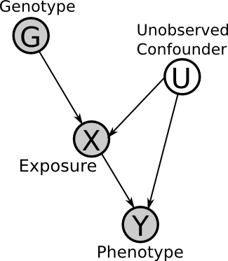
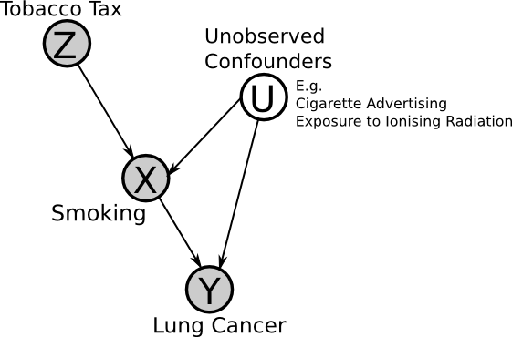
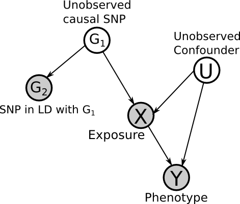
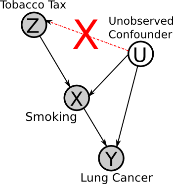
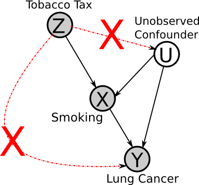
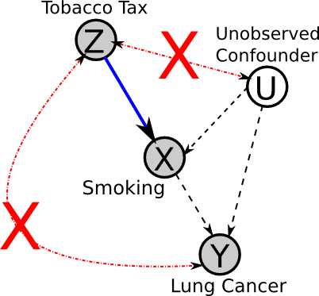
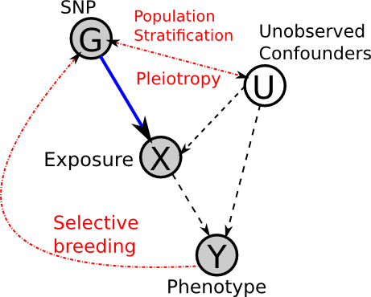

+++
title = "Introduction to Mendelian Randomization"
date = 2014-08-17
[taxonomies]
categories = ["Statistics"]
+++

Mendelian Randomization is an approach to test for a **causal** effect from **observational** data in the presence of certain **confounding** factors.
 It uses the measured variation of genes (of known function) to **bound** the causal effect of a modifiable exposure (environment) on a phenotype (disease). The fundamental idea is that the genotypes are **randomly assigned** (due to recombination in meiosis under certain assumptions), and this allows them to be used as an **instrumental variable**.

<!-- more -->

Here is the Directed Acyclic Graph (**DAG**) for the basic set-up. Here **G** is the observed genotype (i.e. the presence of a SNP), **X** is an environmental exposure, **U** is a (possible) unobserved confounder and **Y** is the phenotype (i.e. disease status). This will be explained in detail later.

## Motivation

Mendelian Randomization is a useful technique precisely because it allows for causal inference from **observational data**. **Randomised Control Trials** (RCTs) are the gold standard for causal inference, but is not always ethical or possible to carry out RCTs. For example, we cannot randomly assign a lifetime of heavy smoking (or non-smoking) to groups of individuals. This leads to a need to use observational data, however this requires many **assumptions**. 

## Instrumental Variables (IVs) 

In the previous **DAG**, **G** is the **instrumental variable** (or instrument), because it affects **Y** only through **X** (that is, exclusively, no other path may exist). Therefore, under certain **assumptions** (to be explained later), if **G** is correlated with **Y** then we can infer the edge **X -> Y** (note that **X** must be correlated with **G**).

Now we will consider an example application of instrumental variables, for a hypothetical investigation of the effect of smoking on lung cancer.

If the **assumptions** of the instrumental variable method are met, then if we observe that an increase in tax leads to a reduction in lung cancer, then one can infer that smoking is a "cause" of lung cancer (though perhaps indirectly, i.e. it's not smoking directly that causes cancer but the build-up of tar in the lungs, etc.).

## Assumptions of the Instrumental Variables method
Assumptions are necessary in all areas of statistics, however it is important to know what assumptions we are making and whether they hold true.

### Z -> X must exist

We must know **a priori** that the causal direction is **Z -> X** and not **X -> Z**. This is what makes the causal structure unique and **identifiable**. Note this does not mean that **Z** has to be the "true" cause of **X**. For example, if **Z** is a SNP, we can choose a SNP in linkage disequilibrium with **Z**, so long as it is independent of all of the other variables, but still correlated with **X**. Note the more correlated that **Z** is with **X**, the better the power will be (i.e. less data required for significant results), if it is not correlated, it cannot be used as an instrumental variable.

### Z must be independent of U 

No factor can affect both the instrument and the effects. For example, there cannot be a factor that causes both higher tobacco taxes and less cancer (e.g. if we were comparing rates in different cancers between countries, national health awareness could be such a factor).

### No Z -> Y

**Z** cannot directly affect **Y** (or indirectly, except through **X**). I.e. there cannot exist any other mechanisms through which **Z** affects **Y** (i.e. high tobacco tax increases substance abuse, leading to higher rates of cancer).

### Faithfulness

Faithfulness is the assumption that the true underlying DAG will manifest itself in the **observed data** - that is, that the causal effects will not **cancel out**. This is a reasonable assumption, because the contrary would require very specific parameters.

However, note that if relations are deterministic, the implied conditional independencies of the DAG do not hold true, and the assumption of faithfulness is violated. But we will not concern ourselves with this.

 Also note that, in practice, the **sample size** is very important in testing the significance of the correlations/independencies in the data.

### Summary of assumptions 

This DAG summarizes the necessary assumptions for the use of instrumental variables:

## Mendelian Randomization

The method of Mendelian Randomization was first introduced in: *Apolipoprotein E isoforms, serum cholesterol, and cancer.*, Katan MB (1986).

 At the time, epidemiologists were wondering whether low serum cholesterol levels increase the risk of cancer. They were known to be correlated, but it could be that latent tumors caused the lower cholesterol levels (i.e. reverse causation), or that both cancer risk and cholesterol levels were affected by another factor, such as diet (i.e. confounding).

However, Katan noticed that patients with Abetalipoproteinemia (a genetic disease that leads to the inability to absorb cholesterol), did not appear predisposed to cancer, despite the predisposition to lower levels of serum cholesterol.

This led Katan to the idea of finding a large group of individuals genetically predisposed to lower cholesterol levels. These individuals are assumed to be the same with respect to other possible confounders (social class, etc.) and so the presence of the cholesterol-affecting allele can be used as an instrumental variable - this is **Mendelian Randomization**.

 The Apolipoprotein E (**ApoE**) gene was known to affect serum cholesterol, with the **ApoE2** variant being associated with lower levels. Many individuals carry ApoE2 variant and so have **lower serum cholesterol levels** from birth.

 Since genes are **randomly assigned** during meiosis (due to recombination), ApoE2 carriers should not be different from ApoE carriers in any other way (diet, etc.), so there is no confounding via the genome - note these are **assumptions**. It is this which allows the genotype to be used as an instrumental variable in this way (because it is akin to an intervention in a Randomised Control Trial).

Therefore if low serum cholesterol is really causal for cancer risk, the cancer patients should have more ApoE2 alleles than the controls - if not then the levels would be similar in both groups.

Katan only provided the suggestion, but the method has since been used for many different analyses with some success, such as the link between blood pressure and stroke risk. However, some conclusions have later been disproved by Randomised Control Trials. To understand why, we must consider the **biological assumptions**.

## Biological Assumptions
### Panmixia
Recall the assumption that the genotype is randomly assigned - this implies **panmixia**. That is, there is **no selective breeding** (so random mating). This implies that all recombination of alleles is possible.

In our DAG, this means that **G** is not influenced by **Y** (or any other variables). However, this assumption is not always entirely accurate, as demonstrated by **Population Stratification**

### Population Stratification
Population Stratification is the **systematic difference** in allele frequencies between subpopulations, due to ancestry. For example, physical separation leads to **non-random mating**. This then leads to different **genetic drift** in different subpopulations (i.e. changes in allele frequency over time due to repeated random sampling).

This means that the genotype is **not** randomly assigned when considered across different sub-populations, a good example of this is with the difference in rates of lactose intolerance between Northern Europe and Asia.

### Canalization
Canalization refers to the variation in the **robustness of phenotypes** to changes in the genotype and environment.

The classic example is Waddington's Drosophilia experiment. In the experiment, Drosophilia pupae were exposed to heat shock (i.e. a rapid increase in temperature). Eventually a Cross-veinless phenotype (no cross-veins in wings) was produced. However, by then selectively breeding the resulting flies for this phenotype, it eventually appears without heat shock.

This led to theory of organisms rolling downhill in to "canals" of the **epigenetic landscape** with development, becoming more robust to variation of the environment. We can think of it like an optimization problem which settles in local minima.

 The exact biological/molecular mechanisms of canalization are still unknown. With regards to Mendelian Randomization, it can act as a **confounder** between the genotype, environment and phenotype.

### No Pleiotropy
Pleiotropy is the phenomena whereby one gene can affect many (even seemingly unrelated) phenotypes. Mendelian Randomisation makes the assumption of **no pleiotropy**.

 In this case, this means that we assume the genotype is only influencing the phenotype via the considered exposure. I.e. ApoE2 **only** affects serum cholesterol levels, and cannot affect cancer risk by other, unobserved means.

 This is a big assumption, and **prior knowledge** is necessary. If possible, using multiple, independent SNPs which act through the same path, can help to alleviate this issue, because, if they are all consistent then it is unlikely that they would all have other pathways causing the same change in phenotype. But note that they must be independent, and so cannot be in Linkage Disequilibrium.

### The real DAG?
Considering the above points, perhaps the true underlying DAG looks more like this:

## Conclusion
**Instrumental variables** are a method to infer causal relations from **observational data**, given certain **assumptions**. This method is applied in Genetic Epidemiology with **Mendelian Randomisation**.

This approach has had some success, but the underlying biology still poses some problems with regards to the necessary assumptions. This leaves us with the following questions:

- Can we improve the **robustness** of the inference with more measurements of intermediate phenotypes? (such as gene methylation, RNAseq, proteomics measurements, etc.)?  
    Some work has been done on this under the name of  multi-step Mendelian Randomisation.

- Can we improve identification of appropriate **instruments**? (e.g. as whole genome sequencing makes it easier to identify population stratification)

