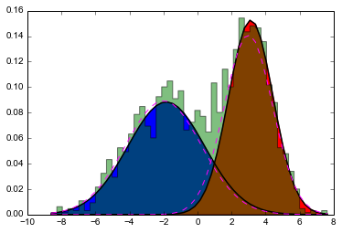

+++
title = "The Expectation Maximisation (EM) Algorithm"
date  = 2014-10-24
[taxonomies]
categories = ["Statistics"]
+++

In this post I will briefly introduce the EM algorithm with two simple examples. The EM algorithm uses an iterative approach to find the Maximum Likelihood estimate for a model with latent variables.

Note I will not provide a thorough coverage of the mathematics but rather focus on two examples of Gaussian Mixture Models.

<!-- more -->

This blog post uses MathJax for rendering the equations and so requires
JavaScript.

## General idea of EM

The objective of the EM algorithm is to obtain Maximum Likelihood estimates of the parameters and the values of latent variables, for a model with latent variables. This is achieved by iteratively updating the values of the latent variables (e.g. in this example, our best estimate of which Gaussian the data point came from) given the current estimate of the model parameters, and then updating the parameters of the model (e.g. the parameters of the Gaussians) given the values of the latent variables.

Note this bootstrap approach makes sense because it is simple to infer missing data given the parameters of the model, and to find the Maximum Likelihood estimates of the parameters for the model, given the data. However note that this can lead to problems with local optima and initialisation.

The likelihood is defined as follows (i.e. probability of the data given the model), but note we usually cannot marginalise over \\(\mathbf{Z}\\) directly: 

$$L(\boldsymbol \theta; \mathbf{X} ) = P(\mathbf{X} | \boldsymbol \theta ) = \sum_z P(\mathbf{X}, \mathbf{Z} | \boldsymbol \theta ) $$

So instead we take this iterative updating approach. We first update our estimate of the expected value of the log-likelihood with respect to the latent variables, \\(\mathbf{Z}\\), given our current estimate of the model parameters. Then, using this soft assignment, we update our estimates of the parameters.

Assigning \\(\mathbf{Z}\\) (i.e. the Gaussian assignments in this example - technically we are calculating the conditional distribution  \\(P(\mathbf{Z}|\mathbf{X},\boldsymbol \theta)\\) ): 

$$Q(\boldsymbol \theta | \boldsymbol \theta^t ) = \mathbb{E}_{Z|X,\theta^t} \left [ \log ( L(\boldsymbol \theta; \mathbf{X}, \mathbf{Z} )) \right ] $$

Updating the parameters \\(\boldsymbol \theta\\):

$$\boldsymbol \theta ^{t+1} = \arg\max_\theta Q(\boldsymbol \theta | \boldsymbol \theta^t ) $$ 

## Application to Gaussian Mixture Models

Now let's apply this to the problem of fitting a Gaussian Mixture Model to data. In general the problem is as follows, we wish to fit \\( k \\) Gaussians to describe the mixture of data we observe. The data has \\( D \\) dimensions.

We have a data matrix \\(\mathbf{X}\\) of size \\(N \times D \\), a matrix of assignment probabilities \\(\mathbf{Z}\\) of size \\(N \times k \\), a vector of marginal probabilities of assignment to the Gaussians (i.e. the proportion of points that come from this Gaussian) \\( \boldsymbol \tau \\) which is of size \\(k \times 1 \\). We also have the parameters of the Gaussians: their means \\(\boldsymbol \mu_j\\) of each of size \\(D \times 1\\) and their covariances \\(\boldsymbol \Sigma_j \\) each of size \\( D \times D \\). 

For the sake of brevity, we will first consider fitting two Gaussians in a one-dimensional space. This means that \\(D=1\\), \\(k=2\\) and that the means, \\(\mu_1\\) and \\(\mu_2\\), and the variances, \\(\sigma^2_1\\) and \\(\sigma^2_2\\) are all scalars.

      
  
An example of an EM solution to a 1D mixture of 2 Gaussians. A full example is included later.

### The Likelihood

In this case we can write the likelihood as follows:

$$\begin{align}L(\boldsymbol \theta; \mathbf{X}, \mathbf{Z}) &= P(\mathbf{X}, \mathbf{Z} | \boldsymbol \theta) = \prod_{i=1}^n P(Z_i = z_i ) \  \mathcal{N} (x_i | (\mu_j, \sigma^2_j)) \cr
&= \prod_{i=1}^n \sum_{j=1}^2 \mathbb{I} (z_i = j) \tau_j \   \mathcal{N} (x_i, \mu_j, \sigma^2_j) \end{align}$$

Or in exponential form (so we can take the log):

$$\begin{align}L(\boldsymbol \theta ; \mathbf{X}, \mathbf{Z}) = & \exp \left ( \sum_{i=1}^n  \sum_{j=1}^2 \mathbb{I}(Z_i=j)\right . \cr
& \left . \left [ \log (\tau_j) - \log(\sigma_j )- \frac{1}{2\sigma^2_j} (x_i - \mu_j)^2 - \frac{d}{2} \log(2\pi) \right ] \right )\end{align}$$

Where \\(\mathbb{I}(Z_i=j)\\) is the indicator function (i.e. returns 1 iff. \\(Z_i = j\\), else returns 0).

So the log-likelihood, which we want to maximise is: 

$$\log ( L(\boldsymbol \theta ; \mathbf{X}, \mathbf{Z}) ) = \sum_{i=1}^n  \sum_{j=1}^2 \mathbb{I}(Z_i=j) \left [ \log (\tau_j) - \log(\sigma_j) - \frac{1}{2\sigma^2_j} (x_i - \mu_j)^2 - \frac{d}{2} \log(2\pi) \right ]$$

### The Expectation step

Recall that the Gaussian assignment probabilities are in \\(\mathbf{T}\\), this is what we wish to return in the E-step. From Bayes Rule:

$$\mathbf{T}_{j,i}^t  = P(Z_i = j | X_i=x_i, \boldsymbol \theta^t) = \frac{\tau_j^t \ \mathcal{N}(x_i; \mu_j^t, \sigma_j^t)}{\tau_1^t \ \mathcal{N}(x_i; \mu_1^t, \sigma_1^t) + \tau_2^t \ \mathcal{N}(x_i; \mu_2^t, \sigma_2^t) }$$

This can also be expressed in terms of \\(Q\\):

$$\begin{align}Q(\boldsymbol \theta | \theta^t ) &= \mathbb{E} \left [ \log L(\boldsymbol \theta; \mathbf{X}, \mathbf{Z} ) \right ] = \mathbb{E} \left [ \log \prod\_{i=1}^n L(\boldsymbol \theta; \mathbf{X}\_i, \mathbf{Z}\_i ) \right ] \cr
&= \mathbb{E} \left [ \sum\_{i=1}^n \log  L(\boldsymbol \theta; \mathbf{X}\\_i, \mathbf{Z}\\_i ) \right ] = \sum\_{i=1}^n \mathbb{E} \left [  \log  L(\boldsymbol \theta; \mathbf{X}\\_i, \mathbf{Z}\\_i ) \right ]\end{align}$$

$$Q(\boldsymbol \theta | \theta^t )= \sum\_{i=1}^n \sum\_{j=1}^2 \mathbf{T}\_{j,i}^t \left [ \log \tau\_j - \log ( \sigma\_j ) - \frac{1}{2\sigma\_j^2} (X\_i - \mu\_j) - \frac{d}{2} \log(2\pi ) \right ] $$

But we only need  \\(\mathbf{T}\\) to compute the updates.

### The Maximisation step

In this step we update our estimates for all of the parameters.

First let's update our estimates for \\(\boldsymbol \tau\\), the marginal probabilities for assignment to the Gaussians. Recall that \\(\tau_1 + \tau_2 = 1\\). The update rule is as follows:

$$\begin{align}\tau^{t+1} &= \arg\max\_{\boldsymbol \tau} Q(\boldsymbol \theta | \boldsymbol \theta^t ) \cr
&= \arg\max\_\tau \left ( \left [ \sum\_{i=1}^n \mathbf{T}\_{i,1}^t \right ] \log \tau\_1 + \left [ \sum\_{i=1}^n T\_{2,i}^t \right ] \log \tau\_2 \right ) \end{align}$$

This has the same for as the Maximum Likelihood Estimate for the binomial distribution, so the update rule is:

$$\tau\_j^{t+1} = \frac{\sum\_{i=1}^n \mathbf{T}\_{j,i}^t }{\sum\_{i=1}^n \left ( \mathbf{T}\_{1,i}^t + \mathbf{T}\_{2,i}^t \right )} = \frac{1}{n} \sum\_{i=1}^n  \mathbf{T}\_{j,i}^t$$

We now wish to estimate \\(\mu_1\\) and \\(\sigma_1\\):

$$\begin{align}(\mu_1^{t+1} , \sigma_1^{t+1} ) &= \arg\max_{\mu_1, \sigma_1} Q ( \boldsymbol \theta | \boldsymbol \theta^t) \cr
&= \arg\max_{\mu_1 , \sigma_1} \sum_{i=1}^n \mathbf{T}_{1,i}^t \left ( - \log(\sigma_1 ) - \frac{1}{2 \sigma_1 ^2 } (x_i-\mu_1)^2 \right )\end{align}$$

This has the same form as a weighted Maximum Likelihood Estimator for a normal distribution, so the update rules are as follows:

$$\mu\_1^{t+1} = \frac{\sum\_{i=1}^n \mathbf{T}\_{1,i}^t X\_i}{\sum\_{i=1}^n T\_{1,i}^t }$$

$$\sigma\_1^{t+1} = \frac{\sum\_{i=1}^n \mathbf{T}\_{1,i}^t \left (X\_i - \mu\_1^{t+1} \right ) ^2}{\sum\_{i=1}^n \mathbf{T}\_{1,i}^t}$$

And equally for the second Gaussian (note the updates are independent):

$$\mu\_2^{t+1} = \frac{\sum\_{i=1}^n \mathbf{T}\_{2,i}^t X\_i}{\sum\_{i=1}^n T\_{2,i}^t }$$

$$\sigma\_2^{t+1} = \frac{\sum\_{i=1}^n \mathbf{T}\_{2,i}^t \left (X\_i - \mu\_2^{t+1} \right ) ^2}{\sum\_{i=1}^n \mathbf{T}\_{2,i}^t}$$

We carry out these updates alternately until the log-likelihood converges.

## Interactive example for 2 clusters in 1D

<object data="em1ex.html" width="800" height="600">Could not load plot.</object>

Slide the slider to change the iteration number (shown in the title).

The full code is available in [an IPython notebook here](http://nbviewer.ipython.org/github/jamesmcm/jamesmcm.github.io/blob/source/source/notebooks/EM1Dfinal.ipynb).

## Extension
This example  can also be extended to larger numbers of dimensions (though using a Gaussian Mixture Model directly in a high dimensional space is unadvisable), and to any number of Gaussians. In this case the variances become covariance matrices and linear algebra is necessary, but the changes are straightforward.

Here is an example for a mixture of 4 Gaussians in 2D:

<object data="EM2dtest2.html" width="800" height="600">Could not load plot.</object>

Slide the slider to change the iteration number (shown in the title).

The code is available in an [IPython notebook here](http://nbviewer.ipython.org/github/jamesmcm/jamesmcm.github.io/blob/source/source/notebooks/EM2dGMMfinal.ipynb).

## Conclusion

The EM algorithm is very useful for optimising the parameters of a model with latent variables. Example applications of this, include clustering and hidden Markov models.

Note however, that it can be prone to overfitting, and good initialisation is critical due to the presence of many local maxima in the likelihood function. Note the algorithm can also be extended to find Maximum A Posteriori estimates instead of Maximum Likelihood estimates.

One major drawback is that we must choose the cardinality of the latent space (i.e. the number of Gaussians in the mixture, in this example) a priori. There are some Bayesian methods to avoid this, which may be the topic of a future blog post.

## Resources
### Text

- Chapter 9 of Bishop's <it>Pattern Recognition and Machine Learning</it> covers the EM algorithm in detail, including this example.
- Chapter 19.2.2 of Koller and Friedman's <it>Probabilistic Graphical Models</it> also covers the EM algorithm with respect to Bayesian networks.
- The [Wikipedia article](http://en.wikipedia.org/wiki/Expectation%E2%80%93maximization_algorithm) also covers this example.
- [This article](http://www.seanborman.com/publications/EM_algorithm.pdf) by Sean Borman covers the theoretical justification for the EM algorithm.

### Video

- The EM algorithm is covered within the "Learning with Incomplete Data" section of [Daphne Koller's Coursera course on Probabilistic Graphical Models](https://class.coursera.org/pgm-2012-002/lecture).
- The EM algorithm is also covered in [some of MathematicalMonk's YouTube videos](https://www.youtube.com/watch?v=AnbiNaVp3eQ&list=PLD0F06AA0D2E8FFBA&index=116).

### Other

- Many thanks to [this blog post](https://jakevdp.github.io/blog/2013/12/05/static-interactive-widgets/) for the implementation of static IPython widgets for Javascript.
- Many thanks to [this StackOverflow answer](http://stackoverflow.com/a/12321306/1472461) for the code to plot confidence intervals for arbitrary 2-dimensional Gaussians.

