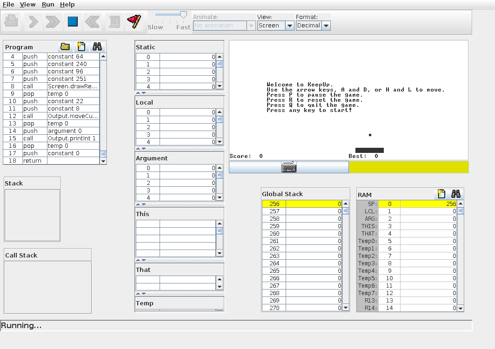
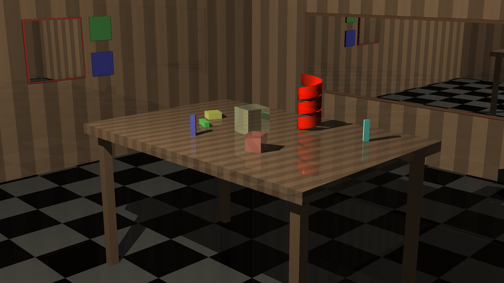
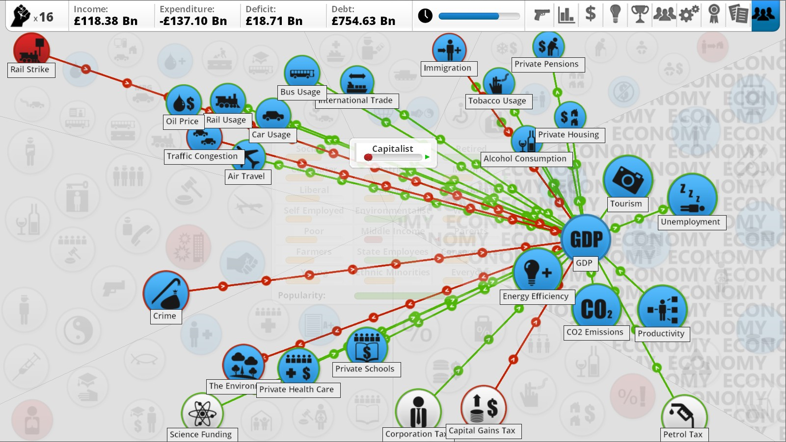
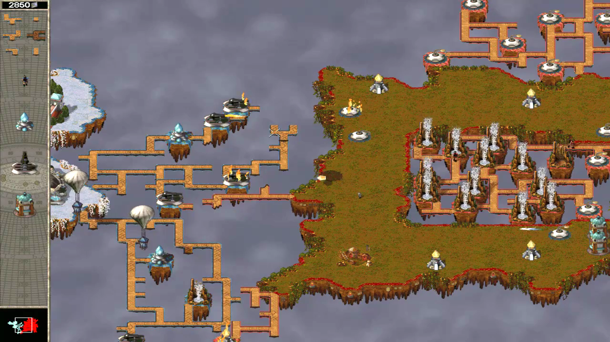

+++
title = "What should I program?"
date = 2020-10-11
[taxonomies]
categories = ["General"]
+++

Doing projects is often the best way to get more programming experience
and learn about new concepts and problem domains. However, a common issue 
is finding feasible projects of a reasonable scope that can 
produce something useful in a few weekends.

In this post I will list some classic project ideas for beginner and
intermediate programmers (most of which should be achievable in 2-3
weekends), along with many other project ideas I've had but have never
had time to implement (and a few which I did).

There are many long lists of project ideas available on Github, like
[build-your-own-x](https://github.com/danistefanovic/build-your-own-x)
and [100 Projects of Code](https://github.com/aceking007/100ProjectsOfCode)
but these often lack a real description and justification of the
projects. In this article I will go more in-depth with the different project ideas.

Within each section the projects are ordered in ascending difficulty /
time investment.

<!-- more -->

Opinions expressed are solely my own and do not express the views or opinions of my employer.

# Classic projects

In this section I list some classic project ideas, in ascending order of
time investment / difficulty. I'd recommend these to all new
programmers.

## Sudoku solver

Since a [Sudoku](https://en.wikipedia.org/wiki/Sudoku) grid is only 9x9, it is feasible to just use Depth First
Search and check if the grid is still valid at each step (backtracking
when it isn't).

This approach means this is a very simple problem which can be implemented in
less than an hour, and could be good experience if you are new to graph
search algorithms.

Here is [my implementation in Scala](https://github.com/jamesmcm/scala-sudoku-solver/blob/master/src/main/scala/sudoku/Main.scala) (this was my first Scala
program).

To make it more interesting, you could solve it using [simulated annealing](https://www.adrian.idv.hk/2019-01-30-simanneal/) or
[other methods](https://www.researchgate.net/publication/256087959_Finding_Solutions_to_Sudoku_Puzzles_Using_Human_Intuitive_Heuristics).
Another interesting project using graph search algorithms is [maze solving](https://en.wikipedia.org/wiki/Maze_solving_algorithm).

## TCP client/server or proxy

Writing a TCP client and server, or a TCP proxy server, will force you
to work with multithreading or asynchronous programming (or both - see
[my previous post on asynchronous programming](http://jamesmcm.github.io/blog/2020/05/06/a-practical-introduction-to-async-programming-in-rust/#en) 
if you are unsure of the difference).

I recently wrote a [simple synchronous TCP proxy server](https://github.com/jamesmcm/basic_tcp_proxy) in Rust for
use in [vopono](https://github.com/jamesmcm/vopono) without adding a 
lot of async dependencies. You could also write a
[simple file transfer program](https://github.com/dpohanlon/Transfer)
for example.

## CHIP-8 emulator

[CHIP-8](https://en.wikipedia.org/wiki/CHIP-8) is an interpreted
programming language, that was used on several microcomputers in the
late 1970s. 

The language is effectively a high-level instruction set,
where the opcodes correspond to different instructions from low-level
mathematical operations to high-level operations like drawing on the
screen.

I highly recommend reading 
[Cowgod's Chip-8 Technical Reference](http://devernay.free.fr/hacks/chip8/C8TECH10.HTM)
if you choose to do this project. I wrote [an implementation in Go](https://github.com/jamesmcm/chip8go)
which includes the documentation of the opcodes and some issues which I hit 
mentioned in the README.

Here is my CHIP-8 interpreter running Breakout:

If you enjoy building an emulator/Virtual Machine I'd also recommend the 
[Advent of Code 2019](https://adventofcode.com/2019/day/2) intcode problems
(starting on day 2) which involve building a VM to execute the intcode instructions.

Then if you really want a greater challenge you could try implementing a 
NES or Gameboy emulator (also check out [Reddit's /r/EmuDev](https://www.reddit.com/r/EmuDev/)). The [NesDev Wiki](http://wiki.nesdev.com/w/index.php/Nesdev_Wiki)
is a great resource for the former, combined with [OneLoneCoder's video series](https://www.youtube.com/watch?v=nViZg02IMQo&list=PLrOv9FMX8xJHqMvSGB_9G9nZZ_4IgteYf). 
For the Gameboy the [gbdev community](https://github.com/gbdev/awesome-gbdev) 
has a lot of comprehensive documentation. Here is [a Gameboy emulator compiled to WebAssembly](https://github.com/BlueBlazin/gbemu) for
example.

A great advanced project idea would be a SNES emulator compiled to WebAssembly
that could play peer-to-peer multiplayer over the internet by using
WebRTC and verifying that both players have the same ROM. The (possibly
copyrighted) ROM itself would not need to be sent over the network.

## Nand2Tetris

The [Nand2Tetris course](https://www.nand2tetris.org/) covers everything
from building an [Arithmetic Logic Unit](https://en.wikipedia.org/wiki/Arithmetic_logic_unit) using a simple Hardware
Description Language in the [first course](https://www.coursera.org/learn/build-a-computer), to building an assembler for a
simple instruction set and a compiler for a simple Java-inspired language
in the [second course](https://www.coursera.org/learn/nand2tetris2).

This is the best course I have ever taken, and I wholeheartedly
recommend it to anyone who hasn't completed it already. It is a very
hands-on and fun computer architecture course with the basics of
compilers and operating systems development included too. If you do try
this course, I've uploaded the [KeepUp game I made for Week 8 to Github](https://github.com/jamesmcm/HackKeepUp) so you can try it out.

Here is my assembled game running on the Hack Virtual Machine:

If you find the course interesting, for computer architecture projects
(in addition to the emulator ones mentioned above), you could try
[Project Oberon](http://www.projectoberon.com/), for a simpler project
there is also the [Write your own Virtual Machine](https://justinmeiners.github.io/lc3-vm/) tutorial.

For compilers and programming language development, you might be
interested in reading [Crafting Interpreters](https://craftinginterpreters.com/),
[Writing an interpreter in Go](https://interpreterbook.com/),
[Writing a compiler in Go](https://compilerbook.com/) and the 
[Create your own programming language with Rust](https://createlang.rs/)
online book.

For Operating Systems development, the [osdev Wiki](https://wiki.osdev.org/Expanded_Main_Page)
has a lot of comprehensive resources. There is also the 
[Writing an OS in Rust](https://os.phil-opp.com/) blog series, and the
rust-embedded group's [Rust RaspberryPi OS tutorials](https://github.com/rust-embedded/rust-raspberrypi-OS-tutorials).

[Charles Petzold's Code](https://www.amazon.com/Code-Language-Computer-Hardware-Software/dp/0735611319)
is a lighter and slightly dated book covering similar areas in computer
architecture, which I'd still recommend reading as a companion book and
some appreciation of the history (just like [Linus Torvald's biography](https://www.amazon.com/Just-Fun-Story-Accidental-Revolutionary/dp/0066620732/) is also
good for a very light read about the history of Linux).

Finally, since this entry is actually a course, I also wanted to
recommend other excellent online courses I have completed:

* Andrew Ng's famous [Machine Learning course](https://www.coursera.org/learn/machine-learning) (even if it is slightly
  dated still using Octave now).
* Stanford's [Mining Massive Datasets](https://online.stanford.edu/courses/soe-ycs0007-mining-massive-data-sets)
   ([and the book here](http://www.mmds.org/)) covering different algorithms for processing large datasets.
* Dan Boneh's [Cryptography](https://www.coursera.org/learn/crypto) course
  ([and the book here](http://toc.cryptobook.us/)) - I'd also recommend completing
  the [cryptopals problems](https://cryptopals.com/) if you find this interesting.
* Stanford's [Algorithms](https://www.coursera.org/specializations/algorithms)
  ([and the book here](http://www.algorithmsilluminated.org/)) course covering
  popular algorithms and data structures.

## Ray Tracer

Implementing a [Ray Tracer](https://en.wikipedia.org/wiki/Ray_tracing_(graphics)) is a great project for producing a visible
result that you can share with others. I highly recommend [The Ray Tracer Challenge book](https://pragprog.com/titles/jbtracer/the-ray-tracer-challenge/)
(and don't forget [the bonus chapters](http://www.raytracerchallenge.com/#bonus) at the end!).
The book uses Test-Driven Development and does not prescribe a specific
programming language.

I implemented the [project in Scala](https://github.com/jamesmcm/raytracer_challenge_scala).
If I were to do it again, I'd recommend making sure your primitives are
as fast as possible (i.e. use the appropriate linear algebra libraries)
to ensure better performance later on. I'd also recommend implementing
it such that it can compile to WebAssembly or JavaScript - e.g. with [wgpu in Rust](https://sotrh.github.io/learn-wgpu/)
so that it is easy to show to
others whilst keeping good performance.

Here is an example image from my ray tracer implementation based on The Ray Tracer Challenge (the Scala logo model was created in Blender):

There is also the [Ray Tracing in One Weekend series](https://raytracing.github.io/)
for an alternative resource aimed at C++.

Graphics programming is a very deep rabbit hole. If you find the Ray
Tracer project interesting, I'd definitely recommend Bisqwit's YouTube channel
with videos on [DOOM-style rendering](https://www.youtube.com/watch?v=HQYsFshbkYw),
[Polygon Rasterisation](https://www.youtube.com/watch?v=PahbNFypubE) and 
[Illumination](https://www.youtube.com/watch?v=Nwfm6cpskIM) mostly in C
and C++.

# My project ideas

The above project ideas are very popular and almost a rite of passage
for new programmers now. In this section I will present many different
project ideas I've had but have not had time to fully implement (or even
begin!).

As in the previous section, projects are sorted by approximate difficulty in
ascending order.

## Scrabble solver

[Scrabble](https://en.wikipedia.org/wiki/Scrabble) / Words With Friends 
is a popular word game where you must form the best words from your character
tiles to score the highest points against your opponent.

I wrote a simple [Scrabble solver in Scala](https://github.com/jamesmcm/scala-scrabble-solver)
which uses a more-or-less brute force approach of scoring every possible
word, using [regular expressions](https://en.wikipedia.org/wiki/Regular_expression)
to find possibilities from the word list for each
possible board position. The main issue is that it can be very slow for
complicated boards (i.e. near late-game) taking ~3-4 minutes to produce
the best solution, since it finds all possible moves and then ranks them.

I'd really like to re-implement this in Rust so it could be built for
WebAssembly. Note that in WebAssembly multiple threads are not yet
supported in most browsers, so the solution would need to be
single-threaded. This also makes the performance very important and it
would be necessary to either improve the algorithm if possible (maybe
some sort of [Trie structure](https://en.wikipedia.org/wiki/Trie) could be used instead of separate
regular expressions) or use heuristics to discard many positions/moves
so they don't all need to be evaluated.

But remember that the board bonuses can mean that score isn't directly
correlated with word length, which can make it tricky to define a
heuristic to discard positions/moves. Also you may often have the 3rd and 5th
letter of a word constrained but not the first letter for example, so
the data structure for the word list would need to account for that.

## Crusader Kings 3 save-game file analyzer

[Crusader Kings 3](https://store.steampowered.com/app/1158310/Crusader_Kings_III/) 
is an excellent Grand Strategy game available on GNU/Linux. Overall, the
game is a great improvement to its predecessor, however one feature that
it lacks is the "Chronicle" which, in Crusader Kings 2, documented the
history of your dynasty and their rise to power.

It'd be great to build a WebAssembly based tool that could parse CK3
save game files and show the history of the game (using the title owner
change dates and their respective dynasties), the trees of different
characters' dynasties, and graphs for the number of alive dynasty
members over time, and other interesting metrics.

Whilst running the game in debug
mode - without Ironman mode so achivements are disabled - it is possible
to export a save game in JSON format that is easy to parse. However,
for Ironman saves in the normal game (the most common scenario for
players unlocking achievements) the savegame is serialised in a
different, binary format.

The idea would be to first handle deserialising the relevant parts of
the JSON debug saves to useful structs, and then build this to
WebAssembly with a frontend framework (e.g. [Seed](https://seed-rs.org/))
and some JavaScript (e.g. [plotly.js](https://github.com/plotly/plotly.js)) 
to create the visualisations.

Once something is useful for the debug saves, then a deserialiser for
the Ironman saves could be created. From my brief analysis of the save
files, it seems the fields are in the same order as in the debug saves
and I was already able to extract character IDs, names and faiths for
example.

The end result could be something like [Rakaly](https://rakaly.com/eu4)
([also written in Rust](https://nickb.dev/blog/my-bet-on-rust-has-been-vindicated),
note the [save game analysis crate is FOSS](https://github.com/rakaly/eu4save))
is for Europa Universalis 4 save files
but focussed on the Chronicle functionality. Rakaly has already dealt
with the Ironman issue for EU4 saves too, so it is not insurmountable.

## Using an Xbox One controller as a MIDI synthesizer

Another interesting project would be to be able to use an Xbox One controller to create
music with a software [MIDI](https://en.wikipedia.org/wiki/MIDI) synthesizer.
I found two repositories on Github doing this already:
[midibox360](https://github.com/quotepilgrim/midibox360) and 
[xbox-midi-controller](https://github.com/maxmechanic/xbox-midi-controller).

I tried out midixbox360 but the latency was too high to be usable so I
wrote my own test in Rust. I have the put the [test code on Github](https://github.com/jamesmcm/xboxone_midi),
unfortunately it also has latency issues (though slightly less severe).

At some point I will try the following steps to improve that:

* Using a wired headset to remove any dependency on Bluetooth audio.
* Using the JACK audio system instead of ALSA (and using the `jack`
  feature in the `midir` crate)
* Using a different software MIDI synthesizer (so far I only tried
  [TiMidity++](http://timidity.sourceforge.net/) and adjusting the buffer size)
* Using a Linux kernel [with realtime patches](https://wiki.archlinux.org/index.php/Professional_audio#Realtime_kernel)

Real-time audio is a complicated domain due to the requirement for such
low latency in order for it to be usable, but it'd be great to solve
these issues at some point.

## Alexa skill for Reddit usage

As an Echo Dot owner, it'd be great to write a
[Custom Alexa skill](https://developer.amazon.com/en-US/docs/alexa/custom-skills/understanding-custom-skills.html)
to read and vote on Reddit stories and comments.

I investigated this before and wrote a simple Hello World skill in Rust
and AWS Lambda, using the [alexa_rust crate](https://github.com/arienmalec/alexa_rust) 
(the tutorial in the crate README is quite comprehensive).
The Alexa Skill can be hosted in AWS Lambda, and just needs to handle
the Alexa requests like a state machine, with most of the hard work
being in [defining the interaction model](https://developer.amazon.com/en-US/docs/alexa/custom-skills/create-the-interaction-model-for-your-skill.html).

The main issues I noticed when setting up the skill were:

* There is no way to allow free narration to Alexa, so it wouldn't be
  possible to post comments (narrated by the user) as far as I know.

* Authentication is also tricky, for example, we'd need the user to
  provide their Reddit API key somehow (and save it). Maybe this is possible in the
  skill configuration in the Alexa app (like how the response Cards appear).

It's also a bit awkward to deploy since you are on the hook for hosting
costs (although AWS Lambda gives 1 million free requests). It's a shame
there isn't some sort of free hosting for FOSS community skills (i.e.
I'm not building a skill for my own company/service), especially as this
could be a great tool for accessibility for those with poor eyesight or
arthritis, etc. that would struggle to use a smartphone or computer.

## ALMA docker support + ALMA Hub

As [mentioned in a previous blog post](http://jamesmcm.github.io/blog/2020/09/09/alma/#en),
[ALMA](https://github.com/r-darwish/alma) is a tool for
creating persistent LiveUSB installations of Arch Linux, that can be
configured with [a collection of preset files](https://github.com/jamesmcm/arch-i3-usb)
 (also see [this collection](https://github.com/madskjeldgaard/arch-linux-computermusic-usb) 
 aimed at audio production).

If support were added to install directly to a partition (i.e. not
formatting the entire disk and installing a bootloader), and it were
possible to run in Docker then it might be possible to use ALMA as a
universal Arch Linux installer. 

It would give you the opportunity to try
out the "meta-distribution" of preset files on a LiveUSB or a VM first
(as already exists),
and then install it directly to a disk or partition, even from Windows
(via Docker).

There would likely be a lot of permissions issues to resolve and so on,
but I think this would be a great project and remove the need for a lot
of simplified Arch Linux based distributions like EndeavourOS, Manjaro,
etc.

Eventually the meta-distributions of preset file collections could be
shared on an "ALMA Hub" website - providing screenshots and summaries of
the different configurations available.

## Linux CLI Hex editor

Whilst analysing the Crusader Kings 3 save games mentioned above, it was
a pain not being able to use neovim directly. It is possible to just run
`xxd` on the buffer and put neovim in xxd mode, but then searching for
series of bytes is difficult as it depends on the formatting (i.e. if
xxd split the line or not).

Overall I found [bless](https://github.com/afrantzis/bless) to be the
best hex editor ([ghex](https://wiki.gnome.org/Apps/Ghex) 
is a close second), but it'd be great to have something like this on the
command line, or if possible, as a neovim plugin.

Mainly it'd need to be able to:
* Show separate panes for bytes and text, with the selected text
  synchronised between them.
* Search backwards and forwards for a series of bytes or ASCII or UTF-8
  text from a given position, and give the offset in bytes from the
  starting position.
* Show UTF-8 decoded text for valid UTF-8 bytes (this should be
  optional), useful for reading UTF-8 encoded strings - note in this
  case several bytes would correspond to one UTF-8 character so the
  interface would need to be adjusted.
* Search by decimal values (converted in to bytes using big-endian or
  little-endian hexadecimal).
* Ability to copy from bytes or text columns.

Bless covers most of those use cases, but I'd really love to have it
inside of neovim. I've never written a neovim plugin before so I'm not sure how
feasible this would be.

## Linux packet editor

In the olden days, there was a very easy-to-use packet editor on Windows
called the Winsock Packet Editor (WPE Pro). This made it easy to just
select an application and analyse or modify its traffic.

A screenshot of WPE Pro running on Windows XP:

It'd be great to build something similar on Linux for modern systems,
perhaps using temporary network namespaces and nftables to mark the
packets and run the namespace connection through a proxy server run by
the packet editor.

Things are slightly more complicated nowadays, as almost all connections
will use TLS, so it is necessary to Man-in-the-Middle these connections
(see [mitmproxy](https://mitmproxy.org/) for example).

Note that for memory editing, [scanmem/GameConqueror](https://github.com/scanmem/scanmem)
exists on Linux, although it is not quite as advanced as CheatEngine.

## Command-line Interface Chiptune Tracker

[Chiptunes](https://en.wikipedia.org/wiki/Chiptune) are a type of synthesised music
generated with waveform generators (i.e. an "instrument" in a track might be a sine
wave, with different notes representing different frequencies). Here is
a famous example track: [To Norway With Love](https://www.youtube.com/watch?v=9F0_OOv7EPw)

These are usually created with [music trackers](https://en.wikipedia.org/wiki/Music_tracker),
a good example on Linux is [MilkyTracker](https://milkytracker.org/) 
(I recommend [this tutorial series](https://www.youtube.com/watch?v=N2s04YYO0Wg&list=PLgQLAgklMBxEuPzQUNKc2xSJu5pXx7xVx) for getting started).

It'd be great to create a CLI-based music tracker and an open library
for music tracker development (so it could be extended to WebAssembly
for web-based trackers, etc.)

## Joust Battle Royale

After completing the [Rust WebAssembly tutorial](https://rustwasm.github.io/docs/book/) using Conway's Game
Of Life, and the [Introduction to Rust Web Applications](https://erwabook.com/intro/index.html) tutorial, I thought
it'd be good to try to build a multiplayer browser-based game in WebAssembly.

Unfortunately time constraints meant I didn't get too far, but what I
implemented [is available on Github here](https://github.com/jamesmcm/joust.rs).
The idea was to implement a Battle Royale version of Joust - with many
players trying to eliminate eachother and survive as the stage becomes
smaller.

Note that real-time multiplayer in the browser is hard, as the browser is
restricted to websockets and cannot use UDP.

That said, there are some good examples for inspiration such as
[Crate Before Attack](https://cratebeforeattack.com/) a Worms-style game
written in Rust and WebAssembly, and [Pont](https://www.mattkeeter.com/projects/pont/)
which is an implementation of the Qwirkle board game in Rust and
WebAssembly.

At some point I'd like to retry this idea, perhaps with a less real-time
dependent game, as WebAssembly offers a great opportunity for massively
accessible games - which would work perfectly for games like [Among Us](https://store.steampowered.com/app/945360/Among_Us/).

## Self-hosted Google Keep alternative

When using [Google Keep](https://keep.google.com/) I often wish I could
just edit [org-mode](https://orgmode.org/) style markdown and save notes that way.

The idea here would be to build a web app that opens a markdown editor
when clicking to edit the notes, which supports the TODO and deadline
dates styling of org-mode, but has a clean presentation when just
viewing the notes (like Google Keep).

Ideally it would also support [pygments](https://pygments.org/) style
syntax highlighting for code blocks and [MathJax](https://www.mathjax.org/)
for LaTeX equations support.

This a nice project as it would be very useful, and is very extensible
(i.e. later creating an Android app, etc.)

## AI for Democracy 3

[Democracy 3](https://store.steampowered.com/app/245470/Democracy_3/)
is a political/economic management video game where you
choose social and economic policies to try to win re-election whilst
balancing the economy and popularity with different demographics.

The main game view of Democracy 3 showing the relationships between different variables:

The idea here would be to build an AI that can play the game
successfully, managing the different policy choices 
([Project Cybersyn](https://en.wikipedia.org/wiki/Project_Cybersyn) style).

I investigated this briefly about 5 years ago. All of the equations relating different variables and policies can be
extracted from the game files - note that many have non-linear
relationships. 

The main challenges would be:
* Building a simulation of the game, using the equations in the game
  files (practically re-implementing the bulk of the game). So that
  different policies can be quickly evaluated.
* Building an AI that can effectively learn and optimise the
  relationships between the directly modifiable variables, intermediate variables
  and the final outcome (i.e. election popularity and budget) without
  knowing the relationships a priori.

Once a fast simulation is possible, at least many different methods
could be tried for the policy model itself such as 
[Q-learning](https://en.wikipedia.org/wiki/Q-learning) or
[Deep Q-learning](https://deepmind.com/research/publications/playing-atari-deep-reinforcement-learning).

For learning more about Artificial Intelligence, I enjoyed Udacity's
[Artificial Intelligence course](https://www.udacity.com/course/ai-artificial-intelligence-nanodegree--nd898)
back when it used to be free to audit, unfortunately it is now stupidly
expensive, but you might be able to get a similar experience by reading
[Peter Norvig's Artificial Intelligence: A Modern Approach](https://www.amazon.com/Artificial-Intelligence-Modern-Approach-3rd/dp/0136042597).

## FOSS engine for Netstorm

[Netstorm](https://en.wikipedia.org/wiki/NetStorm:_Islands_At_War) is
a Real-Time Strategy game released in late 1997. Unlike popular RTS
games, the game is more similar to Populous in that you only directly 
control one High Priest and a few other units.

Most of the gameplay revolves around building a network of bridges from randomly available
Tetris-style bridge patterns, and tower defences which have different
ranges and attack patterns. This creates unique puzzle-style competitive
gameplay when played in multiplayer.

A screenshot of Netstorm:

There is still a [popular community](http://www.netstormhq.net/) based
around patched versions of the original game. The project idea here
would be to implement a new engine for the game, that can run natively
on Linux, requiring the base game assets.

There are already many popular examples of FOSS game engine
reimplementations such as [OpenRCT2](https://openrct2.org/) for Rollercoaster Tycoon 2,
[OpenXCOM](https://openxcom.org/) for X-COM: UFO Defense, and [Exult](http://exult.sourceforge.net/) for Ultima VII.

A FOSS implementation of the game engine would allow for builds on more
platforms, server improvements for multiplayer, and mod creation (i.e.
perhaps a mod for [Factorio-style controls](https://www.youtube.com/watch?v=HAh03WuGrsU)).

If you do choose to investigate this project, I'd recommend reading
[this article on reverse engineering in C++](https://mamclain.com/?page=Blog_Programing_CPP_Data_Padding_and_Alignment)
which mentions NetStorm explicitly, and also to review the source code
for the incomplete [JavaStorm reimplementation](https://github.com/samcday/javastorm) and 
[NetStormSharp](https://github.com/tomjepp/NetStormSharp) which contains
code to read the TARC (archive) and SHP (graphics) formats of the game files.

It'd be great to see more advanced games get FOSS engine implementations
too, such as [Victoria 2](https://vic2.paradoxwikis.com/Victoria_2_Wiki)
which has a large following, but is not
available on Linux and still has no sequel in development.

# Completed projects

With all of the unfinished or unimplemented projects mentioned above,
I'd also like to mention two projects which started out as interesting
ideas just like those, but which I did finish and actively maintain.

## s3rename

[s3rename](https://github.com/jamesmcm/s3rename) is a cross-platform CLI tool for mass-renaming S3 keys. The
idea for this project originally came from having to rename loads of
keys in an S3 bucket for use with AWS Glue (which requires specific
syntax for a partition hierarchy).

At the time I was using a Python script to generate AWS CLI commands, but
this was very slow to run (since all the AWS CLI commands were
independent), and it was a pain to modify the script for different
transformations needed.

s3rename allows you to use sed-style regexes to define the rename
operations, and is implemented in Rust with Tokio for asynchronous
operations so it can process many operations at a time (and is much
faster than calling the AWS CLI separately).

## vopono

[vopono](https://github.com/jamesmcm/vopono) allows you to run
specific applications via VPN connections
with temporary network namespaces on Linux. For example,
you can run Firefox through a VPN
whilst the rest of your system is unaffected.

This originally came from a bash script I had for running OpenVPN in a
network namespace. After porting that to Rust, vopono now has many more
features including Wireguard support, built-in killswitches for OpenVPN
and Wireguard, automatic configuration support for many popular VPN
providers and port forwarding support for running servers and daemons
inside the VPN whilst still being accessible from the host.

# Summary

I hope the project ideas above inspire you to build something yourself, be it
a new implementation of a classic project, or something completely new.

I greatly recommend trying to find something creative and enjoyable which
can be useful within a few weekends to keep motivation high. For
example, I personally use [vopono](https://github.com/jamesmcm/vopono) for all of my VPN usage now, and
that helped a lot to inspire me to keep improving it and covering more
use cases.

If you are an absolute beginner, or still getting comfortable with a new
programming language, then I do recommend doing some small problems on 
websites like [Leetcode](https://leetcode.com/),
[Project Rosalind](http://rosalind.info/about/),
[Advent Of Code](https://adventofcode.com/),
and [Project Euler](https://projecteuler.net/) for example. However, as
you get more comfortable with programming, I think it is more rewarding
to work on larger projects (even if they are still very small in scope
compared to professional work).

It's worth noting that what is considered as a good beginner
project has changed over time. In the past, writing your own [IRC bot](http://wiki.haskell.org/Roll_your_own_IRC_bot) 
(or even client or server) was considered as a rite of passage, but now that the
popularity of IRC has sadly dwindled, this is less common (perhaps you
could write a [Matrix client](https://brendan.abolivier.bzh/enter-the-matrix/) instead).

The same is true for email clients, rudimentary web browsers, CLI text
editors, etc. which don't make as great starter projects now due to the
consolidation of webmail, the increased complexity of modern web pages
(with Javascript support effectively mandatory), and the development of
extensive plugin support for popular text editors.

But the list above is far from comprehensive, for example, there is the
whole world of embedded development from fully-fledged Single-Board
Computers like the Raspberry Pi, to microcontrollers like the Arduino.
The [Embedded Rust Discovery](https://docs.rust-embedded.org/discovery/)
online book introduces embedded programming with the STM32F3DISCOVERY
board for example. You might also consider writing [your own database](https://github.com/erikgrinaker/toydb)
or building [a sqlite clone](https://cstack.github.io/db_tutorial/).

If you are interested in programming projects like these, I'd recommed
joining the [OneLoneCoder community](https://community.onelonecoder.com/) and Discord server,
which has a channel dedicated to sharing projects with the community
(often focussed on video games).

Finally, many of the projects mentioned above depend upon [Free Software](https://www.gnu.org/philosophy/free-sw.en.html),
or at least [Open Standards](https://fsfe.org/freesoftware/standards/def.en.html),
so I'd highly recommend reading 
[Free Software, Free Society (PDF)](https://www.gnu.org/doc/fsfs3-hardcover.pdf)
about the history and importance of the Free Software movement.

