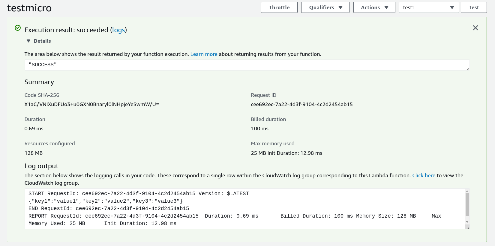
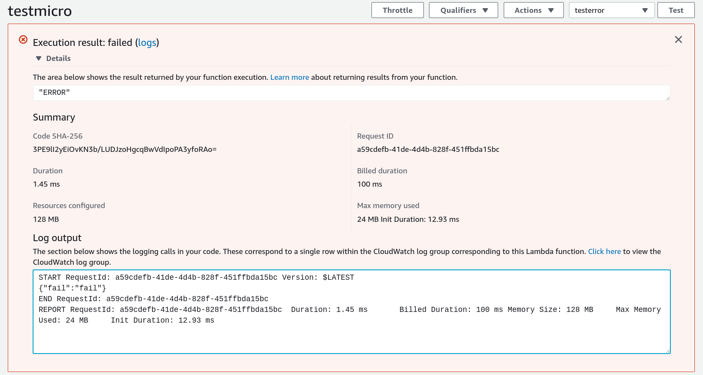

+++
title = "Writing a simple AWS Lambda Custom Runtime in Rust"
date = 2020-10-24
[taxonomies]
categories = ["Rust"]
+++

I was recently reading more about the [lambda_runtime crate](https://crates.io/crates/lambda_runtime)
 and came across [this issue](https://github.com/awslabs/aws-lambda-rust-runtime/issues/259) 
 where it is mentioned that the `#[lambda]` procedural macro can be
 misleading and cause problems if used naively.

In this post we will implement our own simple custom runtime for
AWS Lambda in Rust, and understand the reasons behind this issue.

The code used in this blog post is available on Github in 
my [micro_lambda repository](https://github.com/jamesmcm/micro_lambda).

<!-- more -->

Opinions expressed are solely my own and do not express the views or opinions of my employer.

# AWS Lambda

[AWS Lambda](https://aws.amazon.com/lambda/) is a serverless computing service. I have previously covered
setting up serverless data pipelines [from Excel files on S3](http://jamesmcm.github.io/blog/2020/04/19/data-engineering-with-rust-and-aws-lambda/#en), and
[from email attachments with SES and Workmail](http://jamesmcm.github.io/blog/2020/08/29/rust-ses/#en) using Rust and the
[lambda_runtime crate](https://github.com/awslabs/aws-lambda-rust-runtime).


## Custom Runtimes

A [Custom Runtime](https://docs.aws.amazon.com/lambda/latest/dg/runtimes-custom.html) allows you to run any x86\_64 binary as an AWS Lambda
function, by providing the runtime code to interact with the [AWS Lambda
Custom Runtime API](https://docs.aws.amazon.com/lambda/latest/dg/runtimes-api.html).

The idea is you first retrieve some of the Lambda function settings
provided to the executable as environment variables, run any one-time or
shared initialisation code, and then call the handler function (i.e. the
function that will be called for each invocation), passing it the AWS
Lambda event JSON.

In summary, the runtime code should:
1. Read relevant environment variables, in our case only `AWS_LAMBDA_RUNTIME_API`
   is necessary since we will include the runtime and handler function together in our final binary.
1. Run any initialisation code - note in our case this could be defined
   either as part of the runtime library crate, or in the application
   code prior to passing the handler function to the Lambda runtime.
1. Loop indefinitely, polling the Lambda Runtime API for new
   invocations and sending these to the handler function - then POST the
   output to either the invocation response or error endpoint.

It's important to note that a single runtime execution may serve several
Lambda function invocations if they arrive close together  - this is
called a *warm start*. As opposed to a *cold start* where AWS Lambda has
to spin up the container and start the runtime. For functions that need
to always respond with a very low latency, some users even schedule
dummy invocations (i.e. with a specific Cloudwatch event, etc.)
to keep the runtime running and ensure warm starts.

## Lambda Runtime API

The [AWS Lambda Runtime API](https://docs.aws.amazon.com/lambda/latest/dg/runtimes-api.html) currently contains only four endpoints:

* Initalization error - for if the initialization steps fail (i.e. doing one-time initializations for global resources, etc.) prior to calling the handler function: POST `/runtime/init/error`
* Next invocation - an endpoint from which to GET the invocation event and some metadata (AWS Request ID): GET `/runtime/invocation/next`
* Invocation response - an endpoint to POST the successful response of the handler function: POST `/runtime/invocation/${AwsRequestId}/response`
* Invocation error - an endpoint to POST the error message of the handler function, if it fails: POST `/runtime/invocation/${AwsRequestId}/error`

The base URL for each API call is `http://${AWS_LAMBDA_RUNTIME_API}/2018-06-01/` - note we do not need TLS.

We need to extract the AWS Request ID from the headers returned in the
next invocation response. The body of the response is the JSON for the
triggering event itself (note that the [aws_lambda_events crate](https://github.com/LegNeato/aws-lambda-events) has
templates for deserializing the events from AWS services).

## Runtime library

Using all of the above, we can implement a custom runtime in a very
small amount of code:

```rust
pub fn lambda(handler: fn(&str) -> std::result::Result<String, String>) {
    // Could initialise one-time resources here
    // If initialisation error, POST to /runtime/init/error

    let aws_lambda_runtime_api = std::env::var("AWS_LAMBDA_RUNTIME_API").unwrap();
    // Loop getting new invocation events and passing to handler
    loop {
        let invocation = ureq::get(&format!(
            "http://{}/2018-06-01/runtime/invocation/next",
            aws_lambda_runtime_api
        ))
        .call();

	// Extract AWS Request ID for in order to post responses
        let request_id = invocation
            .header("Lambda-Runtime-Aws-Request-Id")
            .unwrap()
            .to_string();

	// Run the handler function and get the output (note above we
	// specified this will be a Result<String, String> )
        let response = handler(invocation.into_string().unwrap().as_str());

        match response {
	    // If succeeded post output to response
            Ok(res) => {
                let _resp = ureq::post(&format!(
                    "http://{}/2018-06-01/runtime/invocation/{}/response",
                    aws_lambda_runtime_api, request_id
                ))
                .send_string(&res);
            }

            Err(err) => {
                // If invocation error, POST to /runtime/invocation/AwsRequestId/error
                let _resp = ureq::post(&format!(
                    "http://{}/2018-06-01/runtime/invocation/{}/error",
                    aws_lambda_runtime_api, request_id
                ))
                .send_string(&err.to_string());
            }
        }
    }
}
```

In this case we just call `lambda()` with a function that takes a `&str`
(which will be the event JSON), and returns a `Result<String, String>`.

Note that in practice you would want to support different response and error types
(perhaps anything that implements Display), and possibly also
asynchronous handler functions, etc. - this is what the lambda_runtime
crate does.

This code is available on Github in 
my [micro_lambda repository](https://github.com/jamesmcm/micro_lambda).

If you want to follow along, the 
[tutorial on publishing a custom runtime](https://docs.aws.amazon.com/lambda/latest/dg/runtimes-walkthrough.html) is
also very useful - covering an example of an AWS Lambda custom runtime in bash.

## Example Lambda function

Using the above library crate, a Lambda function might look like:

```rust
use micro_lambda::lambda;

fn main() {
    // Put one-time initialisations (loggers, etc.)
    // before calling lambda()
    lambda(handler);
}

fn handler(event: &str) -> std::result::Result<String, String> {
    println!("{}", event);
    if event.contains("fail") {
        return Err("ERROR".to_string());
    }

    Ok("SUCCESS".to_string())
}
```

We can then upload this to AWS Lambda, and verify that it works for a
successful test case:



And for an error test case:



Note when deploying, you will likely want to use static linking by using
the musl target to avoid issues with glibc version mismatches:

```sh
$ cargo build --release --target=x86_64-unknown-linux-musl
$ cp ./target/x86_64-unknown-linux-musl/release/bootstrap ./
$ strip --strip-all ./bootstrap
$ zip bootstrap.zip bootstrap
```

If you do use dynamic linking with glibc, then consider setting the
Lambda function to use Amazon Linux 2 (AL2) in the AWS Lambda Console, so the
container will have a newer version of glibc at least.


## lambda_runtime and #[lambda]

Now we can understand the comment about the `#[lambda]` macro in the
[aforementioned Github issue](https://github.com/awslabs/aws-lambda-rust-runtime/issues/259):

> Due to how cold/warm starts work on Lambda,
> the naive approach of setting up resources (such as loggers)
> within a #[lambda]-decorated block will cause the logger initializer
> to panic in a warm start.

The `#[lambda]` macro allows you to write [simple code](https://github.com/awslabs/aws-lambda-rust-runtime/blob/master/lambda/examples/hello.rs) like:

```rust
#[lambda]
#[tokio::main]
async fn main(event: Value, _: Context) -> Result<Value, Error> {
    Ok(event)
}
```

But it is important to note that in this case the function being wrapped
is treated as the *handler function* ([here is the relevant code](https://github.com/awslabs/aws-lambda-rust-runtime/blob/master/lambda/examples/hello-without-macro.rs)).
That is, any initialisation should take
place *before* the handler function is called, so that it is only run
once even if there are multiple invocations before the runtime is
terminated (this is a "warm start").

This causes problems when new users see the above example, and put
logger intialisation code, etc. in there directly, which will then fail
in the cases of warm starts - which might appear as sporadic and
confusing failures to the developer.

This can be fixed by 
[separating out the handler invocation](https://github.com/awslabs/aws-lambda-rust-runtime/blob/master/lambda/examples/hello-without-macro.rs),
just like we did in our earlier code. In this case it could be:

```rust
#[tokio::main]
async fn main() -> Result<(), Error> {
    // Put any one-time initialisation code up here
    // Before lambda::run is called!
    let func = handler_fn(func);
    lambda::run(func).await?;
    Ok(())
}

async fn func(event: Value, _: Context) -> Result<Value, Error> {
    Ok(event)
}
```

## Summary

I hope it's clear now how the `#[lambda]` macro can cause confusion, and
how to avoid this issue if you write your own Lambda functions.

This might seem a bit overkill for covering such a simple issue, but as
Richard Feynman said:

> What I cannot create, I do not understand.

If you look at the the
[micro_lambda repository](https://github.com/jamesmcm/micro_lambda),
you'll see I tried to reduce the binary size by some means. I'd
originally wanted to write this as 
a [#\[no_std\] crate](https://rust-embedded.github.io/book/intro/no-std.html)
but the requirement to make HTTP requests made this too difficult,
considering the networking required. If you do know how to handle this
well please create an issue or PR on the repo!

Another possible extension of this would be to support the 
[AWS Lambda Extensions API](https://docs.aws.amazon.com/lambda/latest/dg/runtimes-extensions-api.html).
