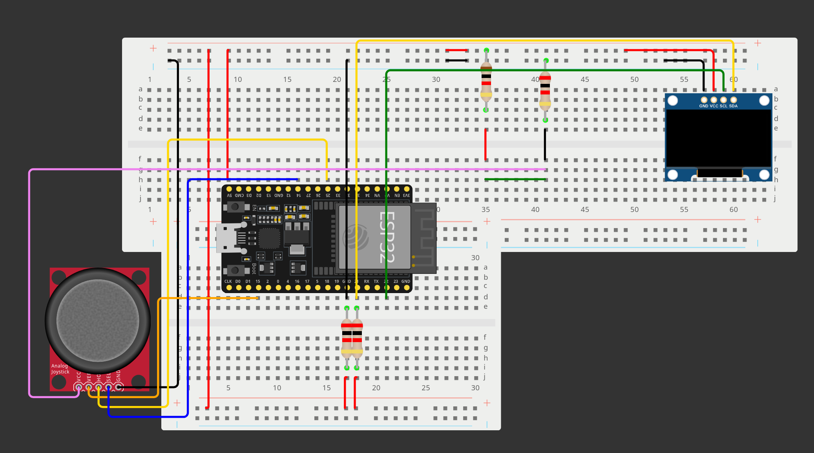

+++
title = "Beginner Rust ESP32 development - Snake"
date = 2024-11-02
[taxonomies]
categories = ["Rust"]
+++

In this post we will create a basic ESP32 project using Rust and espup.

We will write a Snake game to run on an ESP32 development board with a
connected OLED display and controlled with a joystick.

The code for this example is available on Github in my [snake_rust_esp32 repo](https://github.com/jamesmcm/snake_rust_esp32).

<!-- more -->

Opinions expressed are solely my own and do not express the views or opinions of my employer.

## Overview

I started this project to practice deploying Rust on an ESP32 board and
basic peripheral interaction, as a complete beginner with embedded
development and electronics.

The aim was to get more comfortable with the [esp-hal crate](https://docs.esp-rs.org/esp-hal/) and using
[embassy](https://embassy.dev/).

### Video

<br>
<video controls>
  <source src="snake_video_smaller.mp4" width="100%" height="100%" type="video/mp4">
Your browser does not support the video tag.
</video> 
<br>
<br>


## Hardware

I used the following hardware:

* 1x [ESP32-WROOM-32 Xtensa development board](https://www.az-delivery.de/en/products/esp32-developmentboard)
* 1x [SSD1306 128x64 I2C OLED display](https://www.az-delivery.de/en/products/0-96zolldisplay)
* 1x [KY-023 joystick module](https://www.az-delivery.de/en/products/joystick-modul)
* Jumper wires
* 2x Breadboards (joined together in this case, since the development board
  I used is wide).

Wokwi wiring diagram - [project link](https://wokwi.com/projects/413450202628576257), note it does not build online
due to the dependencies:


## Software

First install Rust and espup according to the [Xtensa ESP32 section of the Rust on ESP32 book](https://docs.esp-rs.org/book/installation/riscv-and-xtensa.html).

This project was written without using the standard library, so we use
the `esp-template` no_std template for project generation.

The code can the be built and flashed with:

```bash
$ source ~/export-esp.sh
$ cargo run --release
```

When connected with a data-transfer capable micro-USB cable.

### Initialisation with Embassy

When using Embassy it is important to remember to initialise it with a
timer so that spawned tasks will actually run.

```rust
#![no_std]
#![no_main]

...

#[esp_hal_embassy::main]
async fn main(spawner: Spawner) {
    esp_println::logger::init_logger_from_env();
    let peripherals = esp_hal::init(esp_hal::Config::default());
    let io = esp_hal::gpio::Io::new(peripherals.GPIO, peripherals.IO_MUX);

    let timg0 = TimerGroup::new(peripherals.TIMG0);
    esp_hal_embassy::init(timg0.timer0);
    ...
}
```

### Interacting with the OLED display over I2C

With the OLED display connected (note I used the 5V supply pin), we can interact with using the I2C
communication protocol. We only need 2 GPIO pins for the clock and data.
Any pins can be used for this, but be sure to avoid reserved pins if
your board has those (e.g. pins reserved for SPI expansion, if these are
restricted).

Here we use pins 21 and 22 for data and clock respectively.

```rust
let sda = io.pins.gpio21;
let scl = io.pins.gpio22;
let i2c = esp_hal::i2c::I2c::new(peripherals.I2C0, sda, scl, HertzU32::kHz(100));
```
One useful thing for debugging, is to scan for I2C devices connected to
the pins. This is useful if you do not know which I2C address to use,
but also to confirm that basic communication is working before writing
more code.

This code is adapted from the [ESP32 Embedded Rust at the HAL blog series](https://dev.to/theembeddedrustacean/esp32-embedded-rust-at-the-hal-i2c-scanner-54mg):

```rust
for addr in 1..=127 {
    esp_println::println!("Scanning Address {}", addr as u8);
    let res = i2c.read(addr as u8, &mut [0]);
    match res {
        Ok(_) => esp_println::println!("Device Found at Address {}", addr as u8),
        Err(_) => esp_println::println!("No Device Found"),
    }
}
```

This helped me notice that the I2C pins required pull-up resistors, so I
added two 2k Ohm resistors to the 5V rail.

In our case the address should be `0x3C` (note for some different
SSD1306 displays it could be `0x3D` so confirm this). This is the
default value in the [Ssd1306 crate](https://crates.io/crates/ssd1306), so we do not need to provide this
address manually.

We can initialise the display with the following code:

```rust
let interface = I2CDisplayInterface::new(i2c);
let mut display = Ssd1306::new(interface, DisplaySize128x64, DisplayRotation::Rotate0)
    .into_buffered_graphics_mode();
display.init().unwrap();
```

And then draw using the [embedded_graphics](https://crates.io/crates/embedded-graphics) crate:

```rust
let text_style = MonoTextStyleBuilder::new()
    .font(&self.title_font)
    .text_color(BinaryColor::On)
    .build();
Text::with_baseline(
    "Click stick\nto start! ",
    Point::zero(),
    text_style,
    Baseline::Top,
)
.draw(display)
.unwrap();
display.flush().unwrap();
```

With this, we can draw and update the screen. Note that by default we
are using the [BufferedGraphicsMode](https://docs.rs/ssd1306/0.9.0/ssd1306/mode/struct.BufferedGraphicsMode.html)
which maintains a buffer and writes changes to the display when
`flush()` is called. This can be slow when there are a lot of changes.

### Joystick axes inputs - Analogue to Digital Converters (ADC)

With the display communication working, we can move on to the joystick
inputs. We will start with the axes inputs from moving the joystick,
before handling the joystick clicking (switch) input. Note that only
certain GPIO pins can be used with the ADCs- check this for your board.

One thing to note here is that the KY-023 module has very large dead
zones, so it can really only be used like a Directional-pad with
near-discrete directions, as subtle movements are lost.

For Snake we only need 4 directions - Up, Down, Left, and Right - and
these correspond the extremes of the URX and URY outputs respectively
(note these depends on the orientation you use the joystick in).

These outputs are analogue, so we must use the Analogue to Digital
Converter (ADC) channels on the ESP32 board to read them. The ADCs have
a limited voltage range, so in order to keep using the one 5V output we
can use a voltage divider to reduce the input voltage to the KY-023
module such that the output voltages are within a usable range.

This was done using a 2k Ohm resistor connecting to ground, and a 1k Ohm
resistor connecting to the 5V rail, with input taken in-between them.

With that done, we can carry out some tests to see the maximum and
minimum values from the ADC when moving the joystick and use that to set
the cut-off values for our directions:

```rust
const LOW_JOYSTICK: u16 = 100;
const MID_JOYSTICK: u16 = 1600;
const HIGH_JOYSTICK: u16 = 3500;
```

With these we can set the direction, but we now need a task to read the
ADC and update this in the game code.

This is done with a separate embassy task which we can spawn to run
concurrently. We use the [atomic_enum](https://crates.io/crates/atomic_enum) crate to be able to share and
update the Direction enum atomically.

The task - checking the ADC values every 100ms:

```rust
static PLAYER_DIRECTION: AtomicDirection = AtomicDirection::new(Direction::Right);
static PROCESSED_DIRECTION: AtomicDirection = AtomicDirection::new(Direction::Right);

#[embassy_executor::task]
async fn check_joypad(urx: GpioPin<25>, ury: GpioPin<15>, adc_peripheral: ADC2) {
    let mut adc2_config = esp_hal::analog::adc::AdcConfig::new();
    let mut urx_pin =
        adc2_config.enable_pin(urx, esp_hal::analog::adc::Attenuation::Attenuation0dB);
    let mut ury_pin =
        adc2_config.enable_pin(ury, esp_hal::analog::adc::Attenuation::Attenuation0dB);
    let mut adc2 = esp_hal::analog::adc::Adc::new(adc_peripheral, adc2_config);

    loop {
        let urx_pin_value: u16 =
            esp_hal::prelude::nb::block!(adc2.read_oneshot(&mut urx_pin)).unwrap();
        let ury_pin_value: u16 =
            esp_hal::prelude::nb::block!(adc2.read_oneshot(&mut ury_pin)).unwrap();

        if let Some(direction) = Direction::from_urx_ury(urx_pin_value, ury_pin_value) {
            // We use processed direction to avoid being able to double back if we change
            // direction twice before the next frame
            let current_direction = PROCESSED_DIRECTION.load(Ordering::Relaxed);
            if direction != current_direction && direction != current_direction.opposite() {
                PLAYER_DIRECTION.store(direction, Ordering::Relaxed);
            }
        }

        Timer::after(Duration::from_millis(100)).await;
    }
}
```

Spawning the task and entering the game logic loop:

```rust
let urx = io.pins.gpio25;
let ury = io.pins.gpio15;
let adc2_peripheral = peripherals.ADC2;
spawner.spawn(check_joypad(urx, ury, adc2_peripheral)).ok();
loop {
    game.process_frame(&mut display);
    Timer::after(Duration::from_millis(300)).await;
}
```

### Joystick click switch - interrupts

Now the only remaining part is to handle click inputs from the joystick.
This is done with interrupts - we configure and enable the interrupt, and
then bind a handler function to it which will be called when the
interrupt is triggered.

This is convenient as we do not need to run our own task to check the
input, it will be triggered immediately when the condition is met. Note
we do not do this for the ADC inputs since there we require the ADC to
run i.e. it is not a raw input.

Enabling and registering the interrupt:

```rust
let mut switch = gpio::Input::new(io.pins.gpio14, esp_hal::gpio::Pull::Up);

switch.listen(gpio::Event::FallingEdge);
esp_hal::interrupt::enable(Interrupt::GPIO, Priority::Priority3).unwrap();
unsafe {
    // Do not enable all interrupts!
    // esp_hal::xtensa_lx::interrupt::enable(); https://github.com/esp-rs/esp-hal/discussions/922
    esp_hal::interrupt::bind_interrupt(Interrupt::GPIO, GPIO_HANDLER.handler());
}

critical_section::with(|cs| G_BUTTON.borrow_ref_mut(cs).replace(switch));
```

Note we use the [critical_section](https://crates.io/crates/critical-section) crate as a sort of global mutex.
This is necessary so we can access the switch GPIO input pin to clear
the interrupt after it is handled.

Also take care to only enable the interrupt we are using, and not all
interrupts (see the commented out line above), as that will lead to
errors due to unhandled interrupts. This can be subtle too as crashes
may only occur after running for a while e.g. see
[issue #922 on esp-hal](https://github.com/esp-rs/esp-hal/discussions/922).

The handler itself:

```rust
static CONFIRM_BOOL: AtomicBool = AtomicBool::new(false);
static G_BUTTON: Mutex<RefCell<Option<Input<AnyPin>>>> = Mutex::new(RefCell::new(None));

#[handler(priority = Priority::Priority3)]
fn GPIO_HANDLER() {
    CONFIRM_BOOL.store(true, Ordering::Relaxed);

    critical_section::with(|cs| {
        G_BUTTON
            .borrow_ref_mut(cs)
            .as_mut()
            .unwrap()
            .clear_interrupt();
    });
}
```

Here we just set `CONFIRM_BOOL` when interrupt is triggered, which is
then used in the game loop, e.g.:

```rust
match self.state {
    ...
    GameState::GameOver => {
        if CONFIRM_BOOL.swap(false, Ordering::Relaxed) {
            self.state = GameState::Playing;
            self.reset();
            self.start_game(display);
        }
    }
}
```

## Conclusion

That covers all of the embassy / esp32 related parts of this project (I
won't cover programming Snake itself!). The source code is available  in the [snake_rust_esp32 repo](https://github.com/jamesmcm/snake_rust_esp32) on Github.
The project is also [available on Wokwi](https://wokwi.com/projects/413450202628576257) with the breadboard diagram
but won't build there at the moment.

While the project is very simple, I think the benefits of using Rust are
already apparent. For example, we were able to use the Ssd1306 crate to
safely interact with the OLED display, while having the full expressive
power of Rust's enums for handling game state, and Embassy for easily
spawning asynchronous tasks.

The hardest parts were:
* Not realising the I2C pins needed pull-up resistors to communicate
  properly.
* Working out the right input input voltage for the KY-023 joystick so
  the output would be in a readable range for the ESP32 ADC.

This really just scratches the surface of what is possible with embassy
and Rust on the ESP32 platform. I highly recommend [Floodplain's Rust on ESP32 series on YouTube](https://www.youtube.com/watch?v=o8yNNVFzNnM&list=PL0U7YUX2VnBFbwTi96wUB1nZzPVN3HzgS)
and the associated [rust-on-esp32](https://github.com/flyaruu/rust-on-esp32)
and [esp32-nostd](https://github.com/flyaruu/esp32-nostd) Github repos
for some great examples. The latter has a great example of an async task
to automatically re-connect to the Wifi for example.

The following resources were very useful:
* [LastMinuteEngineers' ESP32 ADC Basics article](https://lastminuteengineers.com/esp32-basics-adc/)
* [The Rust on ESP book](https://docs.esp-rs.org/book/)
* [nostd ESP32 Rust book](https://docs.esp-rs.org/no_std-training/01_intro.html)
* [ESP32 GPIO Interrupts](https://blog.theembeddedrustacean.com/esp32-embedded-rust-at-the-hal-gpio-interrupts)
* [GPIO usage with Embassy on ESP32](https://dev.to/theembeddedrustacean/embassy-on-esp-gpio-5594)
* [I2C Scanner example](https://dev.to/theembeddedrustacean/esp32-embedded-rust-at-the-hal-i2c-scanner-54mg)
* [ADC example](https://dev.to/theembeddedrustacean/esp32-embedded-rust-at-the-hal-analog-temperature-sensing-using-the-adc-3106)

