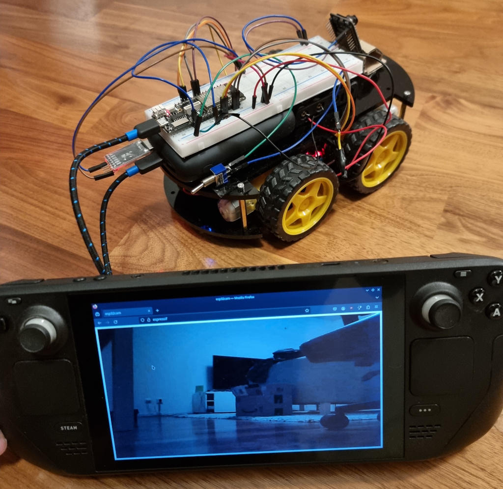

+++
title = "Building a Wifi-controlled car with Rust and ESP32"
date = 2024-11-17
[taxonomies]
categories = ["Rust"]
+++

In this post we will create a basic Wifi-controlled car with an ESP32
development board and ESP32-CAM camera module, and all of the code
written in Rust.

All of the code for this example is available on Github in my [esp32_wifi_tank repo](https://github.com/jamesmcm/esp32_wifi_tank).

<!-- more -->

Opinions expressed are solely my own and do not express the views or opinions of my employer.

## Overview

The project consists of three crates for the rover control board, a client on the host machine, and the camera board.
The esp-wifi connection code was adapted from [@flyaruu's esp32-nostd crate](https://github.com/flyaruu/esp32-nostd),
and the esp32cam code was adapted from [@Kezii's esp32cam_rs](https://github.com/Kezii/esp32cam_rs) crate.



The control board will connect to the given Wifi credentials (at compile
time) with the `wifitank` hostname. The ESP32-CAM camera module will do
the same with the `espressif` hostname.

The client code can then be run
on any machine connect to the same LAN, and will connect to the control
board and camera module via their fixed hostnames.


### Video

<br>
<video controls>
  <source src="rover_video.mp4" width="100%" height="100%" type="video/mp4">
Your browser does not support the video tag.
</video> 
<br>
<br>


## Hardware

* 1x ESP32 Xtensa development board (I used the [Lolin D32 Pro](https://www.aliexpress.com/item/32883116057.html) for this
  project). Although I would not recommend this board for this project
  specifically as it has no 5V output pin. It is nice that it is thin
  enough to use access pins on both sides with a standard breadboard
  though.
* 1x [ESP32-CAM board](https://www.electrokit.com/en/esp32-cam-utvecklingskort-med-wifi-och-kamera) (external antenna is optional)
* 1x UART-USB adapter (I used one like [this one](https://www.amazon.se/AZDelivery-USB-CH340G-omvandlare-Jumperkabel-kompatibel/dp/B08T22HC8K?) - note we need 5V output
  here for the ESP32-CAM)
* 2x [L298N motor drivers](https://www.electrokit.com/en/motordrivare-l298-dubbel-h-brygga-5-35v-2a) 
* 4x DC Gearbox motors (I used [these "TT Motor" ones](https://www.adafruit.com/product/3777) from the kit)
* 1x Robot car chassis (I used the Elegoo one from [this kit](https://www.elegoo.com/products/elegoo-smart-robot-car-kit-v-4-0), but you could also cut
  this from card or 3D print it).
* 1x USB power bank for powering the main ESP32 control board
* 1x Battery holder module - to power the motors via the motor drivers
* 4x AA batteries (I used rechargeable ones)
* 4x wheels and tires - in this case I used the ones from the Elegoo
  kit.

## Software

First install Rust and espup according to the [Xtensa ESP32 section of the Rust on ESP32 book](https://docs.esp-rs.org/book/installation/riscv-and-xtensa.html).

Most of this project was written without using the standard library, so we use
the `esp-template` no_std template for project generation. Note the
esp32cam part does use the `esp-idf-template`.

The code can the be built and flashed with:

```bash
$ source ~/export-esp.sh
$ cargo run --release
```

When connected with a data-transfer capable micro-USB cable.

### Control board code

The control board will connect to the Wifi credentials given as
environment variables at compile time (the code does not yet support
setting credentials at run-time via BLE / Bluetooth), and wait to receive
commands from the client program over UDP.

#### esp-alloc

Since we use no-std here, we need to provide an allocator in order to
use esp-wifi. This code uses esp-alloc to create a 128KiB static heap -
this must be initialised before usage so that the memory allocations
required by esp-wifi will succeed.

This is called in the initialisation steps at the start of the `main`
function:

```rust
fn init_heap() {
    const HEAP_SIZE: usize = 128 * 1024;
    static mut HEAP: MaybeUninit<[u8; HEAP_SIZE]> = MaybeUninit::uninit();

    unsafe {
        esp_alloc::HEAP.add_region(esp_alloc::HeapRegion::new(
            HEAP.as_mut_ptr() as *mut u8,
            HEAP_SIZE,
            esp_alloc::MemoryCapability::Internal.into(),
        ));
    }
}

#[esp_hal_embassy::main]
async fn main(spawner: Spawner) {
    let peripherals = esp_hal::init(esp_hal::Config::default());
    let io = esp_hal::gpio::Io::new(peripherals.GPIO, peripherals.IO_MUX);

    let seed = 0x0123_4567_89ab_cdef;
    init_heap();
    let timg0 = TimerGroup::new(peripherals.TIMG0);
    esp_hal_embassy::init(timg0.timer0);
    ...
```

#### Wifi connection

Here we use esp-wifi for the Wifi connection with no-std. One thing to
note is that the Access Point must support WPA2 Personal authentication,
and use 2.4Ghz channels - WPA3 and 5G are not supported on the board I
used.

At the moment the Wifi credentials are provided as environment variables
at build time (or in `.cargo/config.toml`). 

This code is adapted from [@flyaruu's esp32-nostd crate](https://github.com/flyaruu/esp32-nostd)
which is a great resource for using the esp-wifi crate directly. Also
see his [Rust on ESP32 no_std YouTube series](https://www.youtube.com/watch?v=o8yNNVFzNnM&list=PL0U7YUX2VnBFbwTi96wUB1nZzPVN3HzgS).


We connect to the Wifi as follows (note the use of the [heapless crate](https://crates.io/crates/heapless)
for no-std Strings):

```rust
    ...
    let wifi_ssid = heapless::String::<32>::from_str(env!("WIFI_SSID")).unwrap();
    let wifi_password = heapless::String::<64>::from_str(env!("WIFI_PASSWORD")).unwrap();

    let timg1 = TimerGroup::new(peripherals.TIMG1);
    let wifi_init = esp_wifi::init(
        esp_wifi::EspWifiInitFor::Wifi,
        timg1.timer0,
        rng,
        peripherals.RADIO_CLK,
    )
    .unwrap();

    let wifi_config = esp_wifi::wifi::ClientConfiguration {
        ssid: wifi_ssid,
        bssid: None,
        auth_method: AuthMethod::WPA2Personal,
        password: wifi_password,
        channel: None,
    };


    let (wifi_device, mut wifi_controller): (WifiDevice<WifiStaDevice>, _) =
        wifi::new_with_config(&wifi_init, peripherals.WIFI, wifi_config).unwrap();
    wifi_controller.start().await.unwrap();

    delay.delay(1000.millis());
    for i in 0..20 {
        if wifi_controller.connect().await.is_ok() {
            break;
        }
        log::info!("Failed to connect, retrying - try {}...", i);
        delay.delay(1000.millis());
    }
```

One thing to note is that we have to deal with retries ourselves (and
this is absolutely necessary, expect some failures when connecting) -
there is no retry option in the `connect()` method and retries are
expected to be implemented in the application - see 
[issue #45 in esp-wifi-sys](https://github.com/esp-rs/esp-wifi-sys/issues/45) for example.

With the Wifi connected, we can initialise embassy-net and request an IP address to be assigned via
DHCP.

```rust
type WifiDriver = WifiDevice<'static, WifiStaDevice>;
const CLIENT_NAME: &str = "wifitank";

#[embassy_executor::task]
async fn net_task(stack: &'static Stack<WifiDriver>) -> ! {
    stack.run().await
}

#[esp_hal_embassy::main]
async fn main(spawner: Spawner) {
    ...
    let mut dhcp_config = DhcpConfig::default();
    dhcp_config.hostname = Some(heapless::String::from_str(CLIENT_NAME).unwrap());
    let net_config = NetConfig::dhcpv4(dhcp_config);

    static STACK: StaticCell<Stack<WifiDriver>> = StaticCell::new();
    static RESOURCES: StaticCell<StackResources<4>> = StaticCell::new();
    let stack = &*STACK.init(Stack::new(
        wifi_device,
        net_config,
        RESOURCES.init(StackResources::<4>::new()),
        seed,
    ));

    let mac_addr = stack.hardware_address();
    spawner.spawn(net_task(stack)).unwrap();
    stack.wait_config_up().await;

    match stack.config_v4() {
        Some(a) => log::info!("IP Address appears to be: {}", a.address),
        None => core::panic!("DHCP completed but no IP address was assigned!"),
    }
```

Note at the moment we only use a separate task for running the network
stack, but the Wifi connection code could also be put in its own task
for automatic reconnection like in [@flyaruu's esp32-nostd crate](https://github.com/flyaruu/esp32-nostd/blob/main/src/main.rs#L74-L108).

This ease of writing async checks like that is a great example of the
benefits of using embassy.

Finally we create the UDP socket and start parsing the received
datagrams from the client:

```rust
    ...
    let mut udp_rx_meta = [PacketMetadata::EMPTY; 16];
    let mut udp_rx_buffer = [0; 1024];
    let mut udp_tx_meta = [PacketMetadata::EMPTY; 16];
    let mut udp_tx_buffer = [0; 1024];
    let mut msg_buffer = [0; 128];

    let mut udp_socket = UdpSocket::new(
        stack,
        &mut udp_rx_meta,
        &mut udp_rx_buffer,
        &mut udp_tx_meta,
        &mut udp_tx_buffer,
    );

    udp_socket.bind(8080).unwrap();

    loop {
        let (rx_size, from_addr) = udp_socket.recv_from(&mut msg_buffer).await.unwrap();
        if rx_size == 0 {
            continue;
        }
        let response = msg_buffer[rx_size - 1] as char;
        match response {
            'F' => motors.forward(),
            ...
```

#### Motor drivers

The two L298N motor drivers drive the motors on the left and right side of the
car separately. There is no steering, but we can drive each wheel
independently, so the car is turned like a tank -
driving the motors on one side forwards, and backwards on the other
side.

The [LastMinuteEngineers' Interface L298N DC Motor Driver Module with Arduino article](https://lastminuteengineers.com/l298n-dc-stepper-driver-arduino-tutorial/)
is very useful for understanding the wiring of the motor driver pins.

I wired the GPIO pins as follows:

Left motor driver:

- Pin 13 to EN1
- Pin 12 to EN2
- Pin 26 to EN3
- Pin 25 to EN4


Right motor driver:

- Pin 21 to EN1
- Pin 19 to EN2
- Pin 22 to EN3
- Pin 23 to EN4

As noted in the article setting both inputs to high or low will disable
the motor, whilst one high and one low will turn it either forwards or
backwards.

This is handled in the [motors.rs](https://github.com/jamesmcm/esp32_wifi_tank/blob/master/wifi_tank/src/motors.rs) code.
Note the two motors on the same side are always driven in the same
direction - e.g. both forwards or both backwards.

Here we can see the benefits of Rust's rich type system making it easy
to encapsulate this logic outside of the main control code:

```rust
enum MotorDriverState {
    Stopped,
    Forward,
    Reverse,
}

pub struct MotorDriver<'a> {
    v_a_pin: Output<'a, esp_hal::gpio::AnyPin>,
    v_b_pin: Output<'a, esp_hal::gpio::AnyPin>,
    g_a_pin: Output<'a, esp_hal::gpio::AnyPin>,
    g_b_pin: Output<'a, esp_hal::gpio::AnyPin>,
    state: MotorDriverState,
}

...

#[derive(Debug, PartialEq)]
enum MotorsState {
    Stopped,
    Forward,
    Reverse,
    Left,
    Right,
}

pub struct Motors<'a> {
    left_motor: MotorDriver<'a>,
    right_motor: MotorDriver<'a>,
    state: MotorsState,
}
```

This completes the code for the control board.

### Camera module code

The esp32cam code is used to connect the ESP32-CAM module to the Wifi,
and host a web server where the video can be streamed in the web browser (as a series of
JPGs). This code is a modified version of [@Kezii's esp32cam_rs](https://github.com/Kezii/esp32cam_rs)
crate - note this uses esp-idf so it is not no-std. This code requires SPI RAM to be enabled - `CONFIG_ESP32_SPIRAM_SUPPORT=y` in sdkconfig.defaults.


Omitting the code for the Wifi connection and camera initialisation, the camera stream is served as a multipart stream of jpegs:

```rust
    server.fn_handler(
        "/camera",
        Method::Get,
        move |request| -> Result<(), anyhow::Error> {
            let part_boundary = "123456789000000000000987654321";
            let frame_boundary = format!("\r\n--{}\r\n", part_boundary);

            let content_type = format!("multipart/x-mixed-replace;boundary={}", part_boundary);
            let headers = [("Content-Type", content_type.as_str())];
            let mut response = request.into_response(200, Some("OK"), &headers).unwrap();
            loop {
                if let Some(fb) = cam_arc_clone.get_framebuffer() {
                    let data = fb.data();
                    let frame_part = format!(
                        "Content-Type: image/jpeg\r\nContent-Length: {}\r\n\r\n",
                        data.len()
                    );
                    response.write_all(frame_part.as_bytes())?;
                    response.write_all(data)?;
                    response.write_all(frame_boundary.as_bytes())?;
                    response.flush()?;
                }
            }

            Ok(())
        },
    )?;
```
The home page displays this stream at full-screen, rotated 180-degrees
(since the camera is mounted upside-down):

```rust
    server.fn_handler("/", Method::Get, |request| -> Result<(), anyhow::Error> {
        let data = "<html><head><meta name=\"viewport\" content=\"width=device-width; height=device-height;\"><title>esp32cam</title></head><body></body></html>";

        let headers = [
            ("Content-Type", "text/html"),
            ("Content-Length", &data.len().to_string()),
        ];
        let mut response = request.into_response(200, Some("OK"), &headers)?;
        response.write_all(data.as_bytes())?;
        Ok(())
    })?;
```

So far I did not use an external antenna with the ESP32-CAM module as it
is difficult to solder, although this is recommended. I had many issues with peaks in latency
from the camera, although it's not certain that this is the issue.

Also note I used a 5V input from the UART adapter (via the USB power bank)
to power the ESP32-CAM module as a 5V input is highly recommended for
stability (although a 3.3V input exists too).

#### Flashing the ESP32-CAM module

A major issue I had was being able to flash the ESP32-CAM module with
the code above. I did not buy the [ESP32-CAM-MB](https://sizable.se/P.SJERR/ESP32-CAM-MB-CH340-programmerade-for-ESP32-CAM) module for flashing
it, so I had to use a USB-UART adapter. See the [LastMinuteEngineers' ESP32-CAM article](https://lastminuteengineers.com/getting-started-with-esp32-cam/) for a guide on that too.

In order to flash it correctly I had to do the following:

* Use the 5V input from the USB-UART adapter
* Add a jumper cable between the IO0 pin and the adjacent GND pin on the
  ESP32-CAM board to put it in flashing mode.
* Reset the board with the reset button immediately before flashing (and
  starting the flashing process within 2 seconds of the reset).

The last point is important, otherwise it would just fail to connect
after some time.


### Client code

The controller client uses the [gilrs crate](https://crates.io/crates/gilrs) to detect a USB-gamepad,
and then connects to the rover via its fixed hostname: `wifitank`, and
sends the commands from the D-pad as UDP datagrams.

We set the active gamepad by waiting for the user to press a button:

```rust
#[tokio::main]
async fn main() -> Result<(), Box<dyn Error>> {
    use gilrs::{Button, Event, Gilrs};
    let mut gilrs = Gilrs::new().unwrap();
    let mut active_gamepad = None;

    println!("Push button on gamepad!");
    while active_gamepad.is_none() {
        // Examine new events
        while let Some(Event {
            id, event, time, ..
        }) = gilrs.next_event()
        {
            println!("{:?} New event from {}: {:?}", time, id, event);
            active_gamepad = Some(id);
        }
    }
```

Then we get the IP address for the wifitank:

```rust
const TARGET_HOSTNAME: &str = "wifitank:8080";

#[tokio::main]
async fn main() -> Result<(), Box<dyn Error>> {
    ...
    let addr = env::args()
        .nth(1)
        .unwrap_or_else(|| "0.0.0.0:8080".to_string());
    let socket = UdpSocket::bind(&addr).await?;
    let peer = loop {
        if let Ok(p) = tokio::net::lookup_host(TARGET_HOSTNAME).await {
            if let Some(pi) = p.into_iter().next() {
                break pi;
            }
        }
        tokio::time::sleep(tokio::time::Duration::from_millis(500)).await;
    };
```
Then we loop and check for gamepad input events, and send them to the
rover:

```rust
    ...
    loop {
        while let Some(Event {
            id, event, time, ..
        }) = gilrs.next_event()
        {
            println!("{:?} New event from {}: {:?}", time, id, event);
        }
        {
            let gamepad = gilrs.gamepad(active_gamepad.expect("Gamepad not found!"));
            if gamepad.is_pressed(Button::DPadUp) {
                socket.send_to(b"F", &peer).await?;
            } else if gamepad.is_pressed(Button::DPadDown) {
                socket.send_to(b"B", &peer).await?;
            } else if gamepad.is_pressed(Button::DPadLeft) {
                socket.send_to(b"L", &peer).await?;
            } else if gamepad.is_pressed(Button::DPadRight) {
                socket.send_to(b"R", &peer).await?;
            } else if gamepad.is_pressed(Button::Select) {
                socket.send_to(b"Q", &peer).await?;
                break;
            } else {
                socket.send_to(b"N", &peer).await?;
            }
        }

        tokio::time::sleep(tokio::time::Duration::from_millis(50)).await;
    }
```

Despite the 50ms sleeping, this feels very responsive when in use.

## Conclusion

With all of the above, I was able to connect the rover to the Steam Deck
and drive it around the apartment from another room using just the
camera.

In terms of development, the biggest issues were getting esp-wifi to
connect correctly from the control board (the AP had to be 2.4GHz and WPA2),
and working out how to flash the ESP32-CAM module (it had to be set in
flashing mode and immediately reset before flashing).

The biggest issue in usage however, is the latency spikes in the video
stream. I'm not sure what the best solution is here (perhaps a stream of
JPEGs just isn't practical for low latency despite the simplicity), or
maybe the external antenna is necessary to avoid connection issues as it moves
around the apartment.

Fixing that and provisioning the Wifi credentials via BLE would be the
main things to improve soon.

### Possible improvements

There's a number of improvements left to make in this project:

- Support ESP BLE Provisioning for setting the Wifi credentials via BLE for both
  boards.
- Create a nostd version of the esp32cam crate.
- Motor speed control (use ENA and ENB pins with PWM).
- Test external antenna for ESP32-CAM.
- Test higher input voltage to the motors.
- Add ultrasonic sensors for collision prevention / maze solving.
- Use a development board with 5V out so the motor driver logic can be
  powered from the board.
- Add a voltage regulator and buck converter so the battery pack could
  power the development board too, so the heavy power bank would not be
  needed.

### Future projects

I'd also like to try some of these more complicated projects in the
future:

- Car with separate steering and drive wheels - like an RC car, so it
  can turn while moving.
- Rover with independent steering on all 4 wheels - see [Lukas Deem's rover project](https://www.youtube.com/watch?v=IoCaTgmUSvc)
- ESP-NOW controller - build a controller and communicate with [ESP-NOW](https://www.espressif.com/en/solutions/low-power-solutions/esp-now)
  instead of Wifi.
- RC controller - build a controller to communicate via radio, although
  the Hexapod project below had a lot of issues with this.
- Hexapod - see [Tazer's Hexapod project](https://www.youtube.com/watch?v=TNHBwUZyafo)
- Robot arm - there are a lot of examples of 6 Degrees of Freedom
  robot arms.

## Resources

- [@flyaruu's esp32-nostd crate](https://github.com/flyaruu/esp32-nostd) - the best reference for nostd esp_wifi usage.
- [Floodplain's Rust on ESP32 no_std YouTube series](https://www.youtube.com/watch?v=o8yNNVFzNnM&list=PL0U7YUX2VnBFbwTi96wUB1nZzPVN3HzgS)
- [Embassy on ESP blog series](https://dev.to/theembeddedrustacean/embassy-on-esp-gpio-5594)
- [ESP32 Embedded Rust at the HAL blog series](https://blog.theembeddedrustacean.com/esp32-embedded-rust-at-the-hal-gpio-interrupts)
- [LastMinuteEngineers' in-depth L298N motor driver tutorial](https://lastminuteengineers.com/l298n-dc-stepper-driver-arduino-tutorial/)
- [Rust Networking with the Raspberry Pi Pico](https://murraytodd.medium.com/rust-networking-with-the-raspberry-pi-pico-w-002384a5954b)
- [Rust Client/Server Comms on the Raspberry Pi Pico](https://murraytodd.medium.com/client-server-comms-on-the-raspberry-pi-pico-w-b0767ecfb4dc)
- [IoT with Rust on ESP](https://dev.to/theembeddedrustacean/iot-with-rust-on-esp-connecting-wifi-4be6)
- [Connect ESP32 to Wifi with Rust](https://medium.com/@rajeshpachaikani/connect-esp32-to-wifi-with-rust-7d12532f539b)
- [LastMinuteEngineers' Getting Started with ESP32 CAM](https://lastminuteengineers.com/getting-started-with-esp32-cam/)
- [Joe Thieman's robotics channel](https://www.youtube.com/@joethieman9400)
