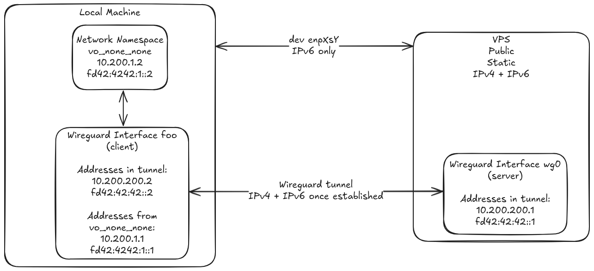

+++
title = "Using the Internet without IPv4 connectivity"
date = 2025-06-25
[taxonomies]
categories = ["Linux"]
+++

A few days ago my ISP broke the IPv4 connectivity from my router after a
power cut. Fortunately IPv6 connectivity still worked fine, but only a
small fraction of websites were accessible.

In this post
I'll cover how Linux, WireGuard, and Hetzner came to the rescue - keeping the whole internet usable
with only an IPv6 connection.

<!-- more -->

Opinions expressed are solely my own and do not express the views or opinions of my employer.

## Background

One morning I woke up with no power, and noticed the breakers had tripped. After
resetting them, everything went back to normal - except I couldn't
connect to GitHub and many other websites.

During the process of contacting my ISP, I realised the issue was only
with IPv4 servers. I could connect fine to IPv6 servers - and this
explained why Google and Meta worked fine, but many websites
didn't. `ping -6` and `traceroute` on both my machine and the router's
diagnostic page confirmed this immediately. It seems this was an issue
with the [Carrier Grade NAT (CG-NAT)](https://en.wikipedia.org/wiki/Carrier-grade_NAT),
and this is why only IPv4 was affected.

Unfortunately, the ISP said they might need to send someone and it would
take several days, after the weekend too. Meanwhile I needed to be able
to access work and my wife needed to finish her thesis, so just leaving
it broken wasn't an option.

Fortunately, I remembered I had a Hetzner VPS server with both static
IPv4 and IPv6 addresses. And luckily, the Hetzner website supports IPv6
so I was able to access the console there to set things up.

But first we need to understand what Network Address Translation (NAT) is.

### Network Address Translation (NAT)

Internet Protocol (IP) addresses are used to specify the source and
destination of IP traffic. Much like a letter with a return
address, you send a packet to a server with its IP address (perhaps
resolved from a domain name) and it will send its reply back to you from
the source address on the packet it received.

However, IPv4 addresses are only 32 bits and, after subtracting the various
reserved blocks, this gives us only ~3.7 billion possible public
IPv4 addresses. Nowadays, with almost everyone having at least an
Internet-connected mobile phone, and possibly several computers,
smartwatches, smart TVs, etc. connected at the same time - there are
simply not enough addresses available to directly address every device
on the Internet.

NAT alleviates this by having several devices share one IP address. For
example, your home router might be assigned only one public IPv4
address, shared by all devices. When the router receives a packet from
one of your devices, it replaces the source IP address (e.g. the local
IP address of your device - 192.168.1.xxx) with its public one.

The router's connection tracking (conntrack) system records the original source IP and port.
When it forwards a packet, it replaces the source with its own public IP and a unique port, storing this mapping.
When a reply arrives at that unique port, conntrack uses the mapping to rewrite the destination back to the original device's internal IP and port.
On Linux you can see the stored mappings with `conntrack -L`.

This is a bit like sending a letter to an office with just the name of
the employee you want to send it to, and their office building. The secretary (NAT) can then handle
getting it to the employee and getting their reply - without you knowing
the exact desk and location of the recipient. You only ever see the
address of the office building (the NATting router).

Incidentally this also acts as an implicit firewall, since any services
on the local devices behind the router will need to be explicitly port
forwarded - i.e. the router forwards all traffic received on a given port to a
specific device and port, and vice versa - modifying the packets like in
the prior example.

But at just the home router level this is still not enough given the
scarcity of IPv4 addresses. So many Internet Service Providers (ISPs)
will apply this again internally - this is called Carrier Grade NAT
(CG-NAT). The concept is identical, only instead of it being a home
router NATting many local devices, it is instead an ISP router NATting many
home routers (which themselves still have their own NATting of local
devices).

Depending on how many IPv4 addresses an ISP owns and is willing to
assign, this process might be
repeated for several levels of hierarchy - e.g. for different regions
that the ISP covers.

It is this process which caused the outage to only affect IPv4 -
somewhere inside the Carrier Grade NAT hierarchy, the packets were not
being NATted correctly, leading to the packets being dropped and a
complete loss of IPv4 traffic.

Note this can also be a hassle if you want to forward services from your
local devices (like video game servers) to the Internet - you may need
to contact your ISP to propagate your port forwarding in the CG-NAT, and
many ISPs will refuse this entirely. I highly recommend reading
[Tailscale's article on How NAT Traversal Works](https://tailscale.com/blog/how-nat-traversal-works)
for different methods to work around this - it is the best networking
article I have ever read.

#### IPv6

IPv6 has so many addresses available that we do not need to use NAT (but
you still can if you want to - e.g. to simplify firewall rules,
although this is not common since direct routing is much more performant). 

IPv6 addresses are 128 bits, after accounting for reserved blocks this
gives us ~3.4E38 addresses.

Due to this abundance of addresses, it is common to receive `/64`
subnets on your home router. That gives you 1.84E19 addresses - far more
than enough for all the smart watches, smart TVs, fridges, mirrors, and
lightbulbs you could ever have.

This means with IPv6 you don't even need to NAT on your home router, and
all of your devices can be directly addressable from the Internet with
no port forwarding issues. However, this also means that your router
and/or the devices themselves must have appropriate firewall rules set
to disallow random new connections to their open ports from anywhere
on the Internet.

This is why there is no CG-NAT applied to IPv6, and why it was
thankfully unaffected by the incident.

Unfortunately a lot of web servers are still not accessible over IPv6
(at the time of writing, the most prominent was GitHub!). This meant it
was necessary to tunnel traffic over IPv6 to restore IPv4 functionality.

## The WireGuard tunnel

The plan was simple: set up WireGuard on the VPS, and then use the IPv6
address as the endpoint in the client-side on my machine. Once the
tunnel is established, IPv4 traffic should then work as normal (albeit with higher latency
via the VPS) - effectively running our own
[Dual-Stack Lite](https://en.wikipedia.org/wiki/IPv6_transition_mechanism#Dual-Stack_Lite_\(DS-Lite\))
(DS Lite - but not the Nintendo console!).

I had previously used
[vps2arch](https://github.com/felixonmars/vps2arch) on my server, to
install Arch Linux
there, which works very well - and I was glad I did it, since it now
meant I had a familiar environment. I used the latest Debian image on Hetzner as the base.
Note you can probably also install Arch Linux manually afterwards by using Hetzner's ISO image mounting (they host
Arch Linux's ISO too, you don't need to set up a custom one).

At first I had some difficulties getting IPv6 traffic to work in the
tunnel (ironically, given the original issue), but eventually got it
working. Here is my full config for reference (adapted from
[the example on the ArchWiki](https://wiki.archlinux.org/title/WireGuard#Specific_use-case:_VPN_server),
but adding IPv6 traffic):

### Server-side

The server-side config:

```ini
# This is the server config
# Place in /etc/wireguard/wg0.conf
# Install wireguard-tools
# Then start with:
# sudo wg-quick up wg0
# You can also set up a service with systemd
# systemctl enable wg-quick@wg0.service
# systemctl start wg-quick@wg0.service

# Generate WireGuard keypairs with:
# wg genkey | (umask 0077 && tee peer_A.key) | wg pubkey > peer_A.pub
# Do this once for the server pair, and once for each client pair

[Interface]
Address = 10.200.200.1/24, fd42:42:42::1/64
ListenPort = 51820
PrivateKey = serverprivatekey # CHANGEME: Set server private key here

# Note here we assume the network device interface is eth0 - remember to check this!
PostUp = iptables -A FORWARD -i %i -j ACCEPT; iptables -A FORWARD -o %i -j ACCEPT; iptables -t nat -A POSTROUTING -o eth0 -j MASQUERADE
PostUp = ip6tables -A FORWARD -i %i -j ACCEPT; ip6tables -A FORWARD -o %i -j ACCEPT; ip6tables -t nat -A POSTROUTING -o eth0 -j MASQUERADE
PostUp = echo 1 > /proc/sys/net/ipv6/conf/all/forwarding
PostUp = echo 1 > /proc/sys/net/ipv4/conf/all/forwarding

PostDown = iptables -D FORWARD -i %i -j ACCEPT; iptables -D FORWARD -o %i -j ACCEPT; iptables -t nat -D POSTROUTING -o eth0 -j MASQUERADE
PostDown = ip6tables -D FORWARD -i %i -j ACCEPT; ip6tables -D FORWARD -o %i -j ACCEPT; ip6tables -t nat -D POSTROUTING -o eth0 -j MASQUERADE

[Peer]
# foo
PublicKey = clientpublickey # CHANGEME: Set client public key here
AllowedIPs = 10.200.200.2/32, fd42:42:42::2/128

[Peer]
# bar
PublicKey = client2publickey # CHANGEME: Set client2 public key here
AllowedIPs = 10.200.200.3/32, fd42:42:42::3/128
```

Note that unlike many .ini-style configuration files, wg-quick allows you
to specify PostUp and PostDown multiple times, and it will execute each command
in order. See the [source for the bash script here](https://git.zx2c4.com/wireguard-tools/tree/src/wg-quick/linux.bash#n50).

#### IPv6 NAT via MASQUERADE

Also note here I am also using NAT with IPv6 (not only IPv4, where it is
necessary), this was just because I
had some problems at first getting direct routing to work, but in theory if you
have a block of addresses for your VPS (e.g. Hetzner gives you a /64 block
for IPv6) you can avoid NAT and make the Wireguard peers directly
addressable via IPv6 Global Unicast Addresses (GUAs) as mentioned
in the NAT section above.

Simply change the Unique Local Addresses (ULAs)
of the peers and interface to the public IPv6 addresses directly and
then remove the ip6tables MASQUERADE rule. Now each of the peers will be
directly addressable from the Internet with their allocated IPv6 address.

If you want to forward
several devices with their own services this would definitely be the way
to go (but you also need to be sure the firewall rules on the VPS
correctly handle incoming traffic).

#### IPv4 SNAT

Finally note you could also use SNAT instead of MASQUERADE if you have a
static IPv4 address on the VPS and are certain it won't
change. This will be slightly more efficient, but didn't seem worth the
effort vs. having a portable config.

### Client-side

The client-side config:

```ini
# This is the client config, run on the client machine with:
# sudo wg-quick up ./foo.conf
# from wireguard-tools
[Interface]
Address = 10.200.200.2/32, fd42:42:42::2/128
PrivateKey = clientprivatekey # CHANGEME: Set client private key here
# Google DNS
DNS = 8.8.8.8
DNS = 2001:4860:4860::8888
MTU = 1280 # This was not in the initial config - see later in the post

[Peer]
PublicKey = serverpublickey # CHANGEME: Set server public key here
# Note the square brackets needed for IPv6
Endpoint = [serveripv6]:51820 # CHANGEME: Change serveripv6 here! If IPv4 do not need square brackets
AllowedIPs = 0.0.0.0/0, ::/0
```

Then with it running on both sides, everything worked smoothly. I could
even directly SSH into the tunnel-local IPv4 and IPv6 addresses to access the server
now.

This solved the issue of regular browsing, and it was also trivial to
install the WireGuard client on Linux for my wife.

However, I still couldn't connect to my work VPN like this since it
would interfere with the WireGuard connection.

## Network namespaces

As the creator of [vopono](https://github.com/jamesmcm/vopono), my
plan was to run the work VPN and any
necessary applications in a network namespace. The trick is to set the
MASQUERADE rule so that it forwards the traffic to the WireGuard
interface (foo above), instead of directly to the actual network
interface (enpXsY).

This way the traffic inside the network namespace is oblivious to the
WireGuard tunnel nftables rules (from wg-quick) outside on the host,
but the traffic will be routed through the WireGuard tunnel.

It's also worth noting that despite wg-quick 
[preferring to use nftables over iptables](https://git.zx2c4.com/wireguard-tools/tree/src/wg-quick/linux.bash#n242) when available,
it manages to avoid conflicts with Docker's standard iptables rules.





We can do this with vopono by specifying the running WireGuard interface
with the `-i` argument. All together it looks like this:

```sh
$ vopono -v exec --create-netns-only --provider None --protocol None -i foo bash
$ sudo ip netns exec vo_none_none bash
$ (inside netns) ./vpn.sh  # Script to run the work VPN
```

Note that `/etc/netns/vo_none_none/` will be mounted to `/etc` in a
mount namespace by `ip netns exec`. This means we can put specific DNS
servers in that `resolv.conf`. Note you can do the same to edit
`gai.conf` if you want to give precedence to IPv4 DNS resolution in the network
namespace for example.

I used the latter when I was still struggling to get IPv6 traffic to
work through the tunnel, here is the `gai.conf` for reference (adapted
from this
[AskUbuntu answer](https://askubuntu.com/questions/32298/prefer-a-ipv4-dns-lookups-before-aaaaipv6-lookups)):

```conf
precedence ::ffff:0:0/96 100
#    For sites which use site-local IPv4 addresses behind NAT there is
#    the problem that even if IPv4 addresses are preferred they do not
#    have the same scope and are therefore not sorted first.  To change
#    this use only these rules:
#
scopev4 ::ffff:169.254.0.0/112  2
scopev4 ::ffff:127.0.0.0/104    2
scopev4 ::ffff:0.0.0.0/96       14
```

So after connecting to the VPN as above, we can put the internal DNS
servers in `/etc/netns/vo_none_none/resolv.conf` so everything works for the next applications launched in
the network namespace. It's a bit awkward that we have to do this after
connecting (since before we can't access these servers), but since the
mount namespace is specific to each `ip netns exec` invocation, the
script can't do it for us (unless we run everything inside that same
bash session, and don't use `ip netns exec` again).

We can then run applications as our normal user in the network namespace
(now going through the work VPN, with the `vpn.sh` script running in
another session):

```sh
$ vopono -v exec -i foo --provider None --protocol None google-chrome-stable
```
But there's still one remaining issue to be able to run everything
needed via the VPN: Docker.

## Docker

Naively running Docker just like other applications above will not
work - the Docker socket was
created outside the network namespace (when enabled with systemd), and
so we won't have any internal connectivity.

However, stopping Docker externally and trying to simply run the Docker
daemon and create the socket within the network namespace also won't
work - this is due to `ip netns exec` creating a mount namespace and
remounting `/sys` - so our host's `/sys/fs/cgroup` won't be visible.

This will give an error like:

```
Error: OCI runtime error: runc: runc create failed: no cgroup mount found in mountinfo
```

(note I think that error was actually from testing with podman-docker)

We can hack around this with the following commands:

```sh
$ (on host) sudo systemctl stop docker && sudo systemctl stop docker.socket
$ (on host) sudo -E unshare -m sh -c 'mount --bind /sys /sys; exec ip netns exec vo_none_none sudo --user archie --preserve-env bash'
$ (in netns) sudo umount /sys
$ (in netns) sudo dockerd --host=unix:///var/run/docker-netns.sock --data-root=/var/lib/docker-netns --default-runtime=runc
$ (in netns) DOCKER_OPTS="--dns=YOURDNSHERE" DOCKER_HOST=unix:///var/run/docker-netns.sock sudo --user archie --preserve-env docker ... # your docker command here
```

This was adapted from [this Unix StackExchange post](https://unix.stackexchange.com/questions/686155/how-can-i-use-a-bind-mount-in-a-network-namespace).
The trick is to use `unshare` to force `/sys` to be a bind mount in the mount namespace
created by `ip netns exec`, and then unmount the internal `/sys` mount created by 
`ip netns exec` - so now `/sys` inside the mount namespace is a bind
mount of the host's `/sys`.

This will only affect this invocation
of `ip netns exec`. But we can then start `dockerd` and our Docker
command in the same session inside the network namespace, so the mount
namespace is the same for both of them.

Note you can also set the Docker DNS settings in
`/etc/netns/vo_none_none/docker/daemon.json`.

Also note this worked for my needs (including one container that uses a
Docker network to connect to a helper container), but it may not work for more
complex Docker set-ups that need bridges,
etc. (although I am sure it is technically possible).

## WireGuard MTU issues

After rebooting my machine I had some issues with the WireGuard
connection where only a few pages would load, and some wouldn't at all -
e.g. GitHub, meanwhile `ping` and `ping -6` worked perfectly.

This was very hard to debug - as even `wg show` showed the WireGuard
connection functioning fine. In the end I found it by doing pings of
different sizes:

```sh
$ ping6 -s 1400 fd42:42:42::1
$ ping6 -s 1200 fd42:42:42::1
$ ping6 -s 800 fd42:42:42::1
```

In this case the first one failed, but the others worked. This revealed 
that the connection issues were due to the WireGuard MTU
setting - larger packets were being dropped. Setting a lower MTU fixed the issues immediately (and is
reflected in the config above).

The Maximum Transmission Unit (MTU) is the largest packet size an interface will handle.
By setting a lower MTU on our local WireGuard interface, we instruct our kernel's IP stack not to create packets larger than this size.
This ensures that after WireGuard adds its own encapsulation overhead, the final UDP packet sent over the internet is small enough to avoid being dropped by any link along the path with a smaller MTU.

When we send a packet to a remote server, the packet hops through
many routers (and undersea cables!) on the way there. Each of these will
have their own MTU and will drop packets larger than that.

So If our MTU is set too high for the route then our packets will be
dropped when they exceed the minimum MTU of the route (i.e. the smallest
MTU along all hops in the route). This is what leads to the confusing,
intermittent behaviour as some packets like pinging are small enough to
be unaffected the MTU anyway, but larger packets being dropped forces
the connection to fail when you actually try to connect with HTTPS for
example.

You can think of this like the weight limit that a postal service has. If
you want to send a 20kg package to a friend in another country, it's not
just enough that your local postal service will accept such a heavy
package, the international airmail service and your friend's local
postal service must also accept it - or it won't arrive.

Note this is a bigger issue for tunnelled traffic like Wireguard since
we are adding ~32 bytes of overhead from the encapsulation (heavy double-packaging in the above
analogy) and are also unlikely to receive any Path MTU Discovery (PMTUD)
messages from intermediate routers, which would inform us of MTU issues
and let us adjust it automatically, since these Internet Control Message
Protocol (ICMP) messages will not be routed back through the tunnel.

The minimum MTU fixed in the specification of IPv6 is 1280, so this
should always work for a tunnel over IPv6.

## Conclusion

In summary, we've covered:

- Creating a WireGuard VPN server on a VPS with IPv4 and IPv6 traffic.
- Using a network namespace to run another VPN over this WireGuard
  interface.
- Using `unshare` tricks to run Docker inside that network namespace.

Internet connectivity issues are always a risk when working remotely,
fortunately in this case Linux was able to save the day and save me from
being entirely at the mercy of whenever the ISP fixes their
configuration.

I hope this is useful to others (and perhaps even myself again in the
future!). It has really demonstrated the benefits of Linux's "fix it
yourself" approach. While Macs are tempting with their great M4
processors, I'd have no idea how to manage all of the above on macOS
(and [my last MacOS experience wasn't great!](@/blog/2020-09-20-catalina-cachedelete.md)).

I highly recommend Hetzner for a VPS, they have great prices and
fully support running WireGuard tunnels and pretty much all legitimate
usage (just no port scanning, traffic spoofing or cryptocurrency mining).
You never know when you might need it. (Note another useful option here might
be a VPN like AirVPN, ProtonVPN or AzireVPN that supports port forwarding so you
can forward ports from your own home servers without relying on your
ISP).

It has also made me consider getting an OpenWRT router for the same
reason. I used to think that managing your own router is unnecessary
extra work (ironically how a lot of people probably think about
GNU/Linux), but being able to debug more on the router side would be
great for problems like this, or even just running Wireguard on it
directly for this work-around without having to configure it on every
device separately.

